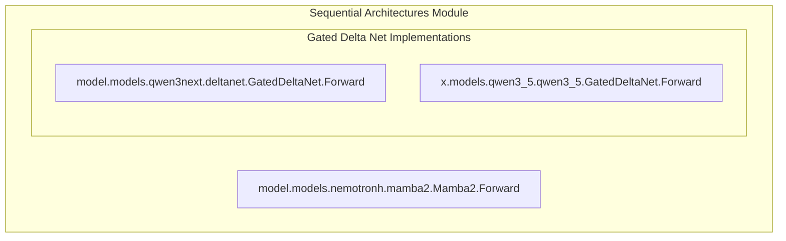

# sequential_architectures
This module provides implementations of various sequential processing layers, including Mamba2 and different versions of Gated Delta Networks, designed for efficient sequence modeling in neural networks.

<!-- DIAGRAM_JSON
{
  "nodes": [
    {
      "id": "Mamba2Forward",
      "label": "Mamba2.Forward",
      "component": "model.models.nemotronh.mamba2.Mamba2.Forward"
    },
    {
      "id": "Qwen3NextGatedDeltaNetForward",
      "label": "Qwen3Next.GatedDeltaNet.Forward",
      "component": "model.models.qwen3next.deltanet.GatedDeltaNet.Forward"
    },
    {
      "id": "Qwen3_5GatedDeltaNetForward",
      "label": "Qwen3_5.GatedDeltaNet.Forward",
      "component": "x.models.qwen3_5.qwen3_5.GatedDeltaNet.Forward"
    }
  ],
  "edges": [],
  "groups": [
    {
      "id": "SequentialArchitectures",
      "label": "Sequential Architectures Module",
      "nodes": ["Mamba2Forward", "Qwen3NextGatedDeltaNetForward", "Qwen3_5GatedDeltaNetForward"]
    },
    {
      "id": "GatedDeltaNetImplementations",
      "label": "Gated Delta Net Implementations",
      "nodes": ["Qwen3NextGatedDeltaNetForward", "Qwen3_5GatedDeltaNetForward"]
    }
  ]
}
-->
