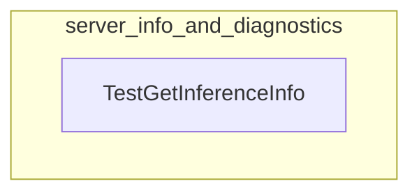

# server_info_and_diagnostics
This module provides utilities for extracting server inference information and diagnostics from application logs. It parses details like compute library, driver versions, VRAM, and default context lengths.

<!-- DIAGRAM_JSON
{
    "nodes": [
        {
            "id": "server_info_and_diagnostics",
            "label": "server_info_and_diagnostics",
            "type": "module"
        },
        {
            "id": "app.server.server_test.TestGetInferenceInfo",
            "label": "TestGetInferenceInfo",
            "type": "component"
        }
    ],
    "edges": [
        {
            "source": "server_info_and_diagnostics",
            "target": "app.server.server_test.TestGetInferenceInfo",
            "type": "contains"
        }
    ],
    "groups": [
        {
            "id": "server_info_and_diagnostics_group",
            "label": "server_info_and_diagnostics",
            "nodes": [
                "app.server.server_test.TestGetInferenceInfo"
            ]
        }
    ]
}
-->
