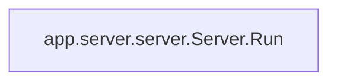

# server_lifecycle
This module manages the lifecycle of the Ollama server, handling its startup, continuous monitoring, and graceful restarts, including conflict resolution and process cleanup.

<!-- DIAGRAM_JSON
{
    "nodes": [
        {
            "id": "app.server.server.Server.Run",
            "label": "Run",
            "type": "method",
            "path": "app.server.server.Server.Run"
        }
    ],
    "edges": [],
    "groups": []
}
-->
