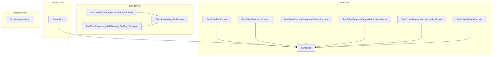

# server_management
This module provides core server management functionalities, including process lifecycle, inference information extraction, cloud proxy handling, and a sophisticated scheduler for managing model loading and execution on available resources.

<!-- DIAGRAM_JSON
{
    "nodes": [
        {
            "id": "server_management",
            "label": "server_management",
            "type": "module"
        },
        {
            "id": "A",
            "label": "Server.Run"
        },
        {
            "id": "B",
            "label": "TestGetInferenceInfo"
        },
        {
            "id": "C",
            "label": "TestCloudPassthroughMiddleware_ZstdBody"
        },
        {
            "id": "D",
            "label": "TestCloudPassthroughMiddleware_ZstdBodyTooLarge"
        },
        {
            "id": "E",
            "label": "TestSchedGetRunner"
        },
        {
            "id": "F",
            "label": "TestSchedPrematureExpired"
        },
        {
            "id": "G",
            "label": "TestSchedRequestsSameModelSameRequest"
        },
        {
            "id": "H",
            "label": "TestSchedRequestsSimpleReloadSameModel"
        },
        {
            "id": "I",
            "label": "TestSchedRequestsMultipleLoadedModels"
        },
        {
            "id": "J",
            "label": "TestSchedAlreadyCanceled"
        },
        {
            "id": "K",
            "label": "CloudPassthroughMiddleware"
        },
        {
            "id": "L",
            "label": "Scheduler"
        },
        {
            "id": "server_info_and_diagnostics",
            "label": "Server Info and Diagnostics",
            "type": "module",
            "link": "server_info_and_diagnostics.md"
        },
        {
            "id": "server_lifecycle",
            "label": "Server Lifecycle",
            "type": "module",
            "link": "server_lifecycle.md"
        },
        {
            "id": "cloud_proxy_middleware",
            "label": "Cloud Proxy Middleware",
            "type": "module",
            "link": "cloud_proxy_middleware.md"
        },
        {
            "id": "scheduler_request_processing",
            "label": "Scheduler Request Processing",
            "type": "module",
            "link": "scheduler_request_processing.md"
        },
        {
            "id": "scheduler_model_management",
            "label": "Scheduler Model Management",
            "type": "module",
            "link": "scheduler_model_management.md"
        }
    ],
    "edges": [
        {
            "source": "A",
            "target": "L"
        },
        {
            "source": "C",
            "target": "K"
        },
        {
            "source": "D",
            "target": "K"
        },
        {
            "source": "E",
            "target": "L"
        },
        {
            "source": "F",
            "target": "L"
        },
        {
            "source": "G",
            "target": "L"
        },
        {
            "source": "H",
            "target": "L"
        },
        {
            "source": "I",
            "target": "L"
        },
        {
            "source": "J",
            "target": "L"
        },
        {
            "source": "server_management",
            "target": "server_info_and_diagnostics"
        },
        {
            "source": "server_management",
            "target": "server_lifecycle"
        },
        {
            "source": "server_management",
            "target": "cloud_proxy_middleware"
        },
        {
            "source": "server_management",
            "target": "scheduler_request_processing"
        },
        {
            "source": "server_management",
            "target": "scheduler_model_management"
        }
    ],
    "groups": [
        {
            "id": "server_core",
            "label": "Server Core",
            "nodes": [
                "A"
            ]
        },
        {
            "id": "cloud_proxy",
            "label": "Cloud Proxy",
            "nodes": [
                "K",
                "C",
                "D"
            ]
        },
        {
            "id": "scheduler",
            "label": "Scheduler",
            "nodes": [
                "L",
                "E",
                "F",
                "G",
                "H",
                "I",
                "J"
            ]
        },
        {
            "id": "inference_info",
            "label": "Inference Info",
            "nodes": [
                "B"
            ]
        }
    ]
}
-->
