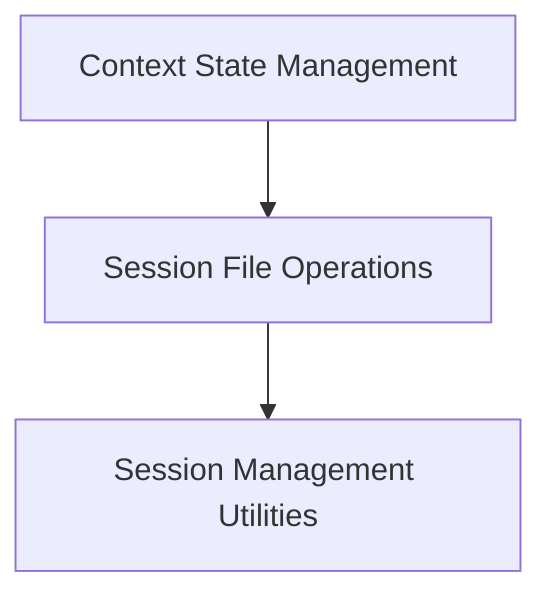

# Session File Operations Module

## Introduction

The `session_file_operations` module is a crucial component within the `llama_cpp_context` and specifically the `context_state_management` sub-module. Its primary purpose is to provide functionalities for saving and loading the state of a `llama_context` to and from session files. This enables the persistence and restoration of conversational or processing states, which is essential for long-running applications or resuming work.

## Architecture Overview

The `session_file_operations` module is focused on handling file-based session persistence. It exposes functions to interact with session files, delegating the core logic to the underlying `llama_state_load_file` and `llama_state_save_file` functions. It is a sub-module of `context_state_management` within the `llama_cpp_context` module.

<!-- DIAGRAM_JSON
{
    "direction": "TD",
    "nodes": [
        {"id": "context_state_management", "label": "Context State Management", "type": "external", "link": "context_state_management.md"},
        {"id": "session_file_operations", "label": "Session File Operations", "type": "module", "link": "session_file_operations.md"},
        {"id": "session_management_utilities", "label": "Session Management Utilities", "type": "module", "link": "session_management_utilities.md"}
    ],
    "edges": [
        {"source": "context_state_management", "target": "session_file_operations"},
        {"source": "session_file_operations", "target": "session_management_utilities"}
    ],
    "groups": []
}
-->

## Sub-modules

### [Session Management Utilities](session_management_utilities.md)
This sub-module encapsulates the core logic for loading and saving session files, providing a clean interface for managing the persistence of `llama_context` states. It contains functions like `llama_load_session_file` and `llama_save_session_file`.
