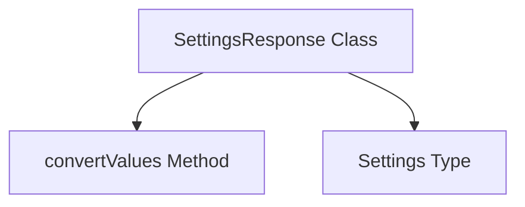

# settings_response_handler Module Documentation

The `settings_response_handler` module is responsible for handling and deserializing settings-related responses within the application's UI layer. It provides a structured way to parse raw data into a `SettingsResponse` object, ensuring type safety and consistency for application settings.

## Architecture and Core Components

The primary component of this module is the `SettingsResponse` class, which acts as a data model for incoming settings data.

<!-- DIAGRAM_JSON
{
    "direction": "TD",
    "nodes": [
        {"id": "settings_response", "label": "SettingsResponse Class", "type": "component", "link": null},
        {"id": "convert_values", "label": "convertValues Method", "type": "component", "link": null},
        {"id": "settings_type", "label": "Settings Type", "type": "external", "link": "app_ui_codegen_types.md"}
    ],
    "edges": [
        {"source": "settings_response", "target": "convert_values"},
        {"source": "settings_response", "target": "settings_type"}
    ],
    "groups": []
}
-->

### Component: `SettingsResponse`

The `SettingsResponse` class is a data transfer object (DTO) designed to encapsulate application settings received from an external source, typically a backend API. It handles the conversion of raw JSON or object data into a strongly typed `Settings` object.

**Core Functionality:**
-   **Deserialization:** The constructor takes a source object (which can be a JSON string or a plain JavaScript object) and initializes the `settings` property by converting the relevant part of the source into a `Settings` instance.
-   **Type Conversion:** It utilizes the internal `convertValues` method to recursively convert values to their appropriate types, especially for complex objects or arrays of objects.

**Properties:**
-   `settings`: An instance of the `Settings` class, holding the actual application settings.

**Methods:**
-   `constructor(source: any = {})`: Initializes a new `SettingsResponse` instance. It attempts to parse a string `source` as JSON and then uses `convertValues` to populate the `settings` property.
-   `convertValues(a: any, classs: any, asMap: boolean = false): any`: A utility method used internally for type conversion. It can handle single objects, arrays of objects, or map-like objects, converting them to instances of the specified `classs`.

### Dependencies

-   **`Settings` Type:** The `SettingsResponse` class depends on the definition of the `Settings` type. This type is expected to define the structure of the application settings. While not explicitly defined in this module, it is likely found within the [app_ui_codegen_types](app_ui_codegen_types.md) module, as `settings_response_handler` is a sub-module of it.

## System Integration

The `settings_response_handler` module plays a crucial role in the UI's interaction with system settings. It acts as an intermediary, transforming raw data into a usable format for other UI components. This module ensures that settings data is consistently structured and easily accessible, contributing to a robust and maintainable UI application. It is specifically located under `app_ui_codegen_types.system_status_responses`, indicating its role in processing generated Go types related to system status, specifically settings.