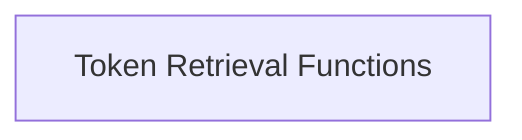

# Special Token Accessors

The `special_token_accessors` module provides a convenient interface for retrieving common special tokens from the `llama_vocab` structure. These tokens are crucial for various NLP tasks, enabling proper handling of sequence boundaries, separation, and padding within the language model.

## Architecture

The `special_token_accessors` module consists of a single sub-module, `token_retrieval_functions`, which encapsulates all the functions for accessing specific special tokens. This design promotes modularity and simplifies the process of obtaining these frequently used tokens.

<!-- DIAGRAM_JSON
{
    "direction": "TD",
    "nodes": [
        {"id": "token_retrieval_functions", "label": "Token Retrieval Functions", "type": "module", "link": "token_retrieval_functions.md"}
    ],
    "edges": [],
    "groups": []
}
-->

## Sub-modules

### [Token Retrieval Functions](token_retrieval_functions.md)
This sub-module provides a set of functions to retrieve specific special tokens like BOS, EOS, EOT, CLS, SEP, NL, and PAD from a given `llama_vocab` instance. Each function acts as a simple accessor to its corresponding token within the vocabulary.