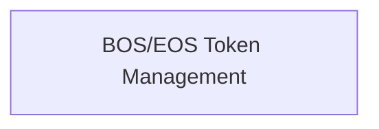

# `special_token_flags` Module Documentation

## Introduction

The `special_token_flags` module is a sub-module of `standard_special_tokens` within the `llama_cpp_vocab` component, responsible for managing the configuration flags related to the addition of special tokens, specifically the Beginning-of-Sentence (BOS) and End-of-Sentence (EOS) tokens, in the LLaMA vocabulary. It provides a straightforward interface to query the current state of these flags, ensuring proper token handling during text processing.

## Architecture

This module contains a single sub-module, `bos_eos_management`, which encapsulates the core logic for checking BOS and EOS token flags. It integrates with the `llama_vocab` structure to retrieve the configuration. The relationship is simple and direct, with `special_token_flags` relying on `bos_eos_management` for its primary functionality.

<!-- DIAGRAM_JSON
{
    "direction": "TD",
    "nodes": [
        {"id": "bos_eos_management", "label": "BOS/EOS Token Management", "type": "module", "link": "bos_eos_management.md"}
    ],
    "edges": [],
    "groups": []
}
-->

## Sub-modules

### BOS/EOS Token Management (`bos_eos_management.md`)

This sub-module focuses on the programmatic access to flags determining whether BOS and EOS tokens should be automatically added to the LLaMA vocabulary. It contains functions to query these settings, which are crucial for consistent tokenization and model inference.
