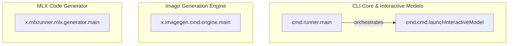

# specialized_execution_engines
This module provides a suite of specialized execution engines, including a general command runner, an interactive model launcher, a dedicated image generation engine, and a code generator for MLX-related functionalities.

<!-- DIAGRAM_JSON
{
  "nodes": [
    {
      "id": "A",
      "label": "cmd.runner.main"
    },
    {
      "id": "B",
      "label": "cmd.cmd.launchInteractiveModel"
    },
    {
      "id": "C",
      "label": "x.imagegen.cmd.engine.main"
    },
    {
      "id": "D",
      "label": "x.mlxrunner.mlx.generator.main"
    }
  ],
  "edges": [
    {
      "source": "A",
      "target": "B",
      "label": "orchestrates"
    }
  ],
  "groups": [
    {
      "id": "CLI_Core",
      "label": "CLI Core & Interactive Models",
      "nodes": ["A", "B"]
    },
    {
      "id": "Image_Engine",
      "label": "Image Generation Engine",
      "nodes": ["C"]
    },
    {
      "id": "MLX_Generator",
      "label": "MLX Code Generator",
      "nodes": ["D"]
    }
  ]
}
-->
