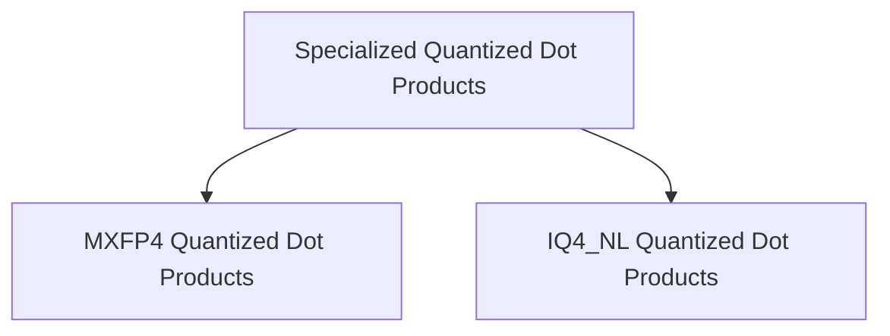

# Specialized Quantized Dot Products

## Introduction

The `specialized_quantized_dot_products` module provides highly optimized implementations of vector dot products for specific quantized data types on x86 CPU architectures. It focuses on accelerating operations involving MXFP4 and IQ4_NL quantized inputs combined with Q8_0 quantized vectors, leveraging advanced CPU instruction sets like AVX and AVX2 for performance.

This module is a critical component within the `x86_vec_dot_0_quants` sub-system, contributing to the efficient execution of quantized neural network models by providing specialized low-level arithmetic operations.

## Architecture Overview

The module is structured into specialized sub-modules, each handling a particular quantization scheme. This design allows for fine-tuned optimizations specific to the data formats involved, ensuring maximum performance.

<!-- DIAGRAM_JSON
{
    "direction": "TD",
    "nodes": [
        {"id": "mxfp4_dot_products", "label": "MXFP4 Quantized Dot Products", "type": "module", "link": "mxfp4_dot_products.md"},
        {"id": "iq4_nl_dot_products", "label": "IQ4_NL Quantized Dot Products", "type": "module", "link": "iq4_nl_dot_products.md"}
    ],
    "edges": [
        {"source": "specialized_quantized_dot_products", "target": "mxfp4_dot_products"},
        {"source": "specialized_quantized_dot_products", "target": "iq4_nl_dot_products"}
    ],
    "groups": [
        {"id": "specialized_quantized_dot_products", "label": "specialized_quantized_dot_products", "nodes": ["mxfp4_dot_products", "iq4_nl_dot_products"]}
    ]
}
-->

## Sub-modules

### [MXFP4 Quantized Dot Products](mxfp4_dot_products.md)

This sub-module contains the implementation for vector dot products where one input is MXFP4 quantized and the other is Q8_0 quantized. It includes highly optimized routines utilizing x86 intrinsic functions for efficient computation.

### [IQ4_NL Quantized Dot Products](iq4_nl_dot_products.md)

The `iq4_nl_dot_products` sub-module focuses on dot product operations involving IQ4_NL quantized inputs and Q8_0 quantized vectors. Similar to the MXFP4 counterpart, it employs specific x86 CPU optimizations to maximize throughput for these particular quantization formats.
