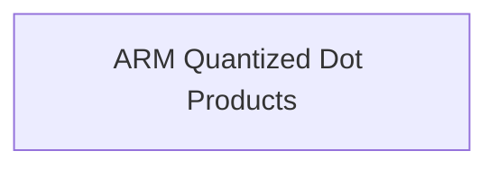

# standard_quant_dot_products Module Documentation

## Introduction
The `standard_quant_dot_products` module is a crucial component within the `ggml-cpu.arch.arm.quants` family, focusing on highly optimized vector dot product implementations for various standard quantization types on ARM architectures. This module is essential for efficient numerical computations in machine learning models that leverage quantized data types to reduce memory footprint and improve performance on ARM-based systems.

## Architecture
The `standard_quant_dot_products` module primarily comprises a single sub-module that encapsulates the core vector dot product functionalities. This design promotes modularity and allows for specialized optimizations for different quantization schemes.

<!-- DIAGRAM_JSON
{
    "direction": "TD",
    "nodes": [
        {"id": "arm_quantized_dot_products", "label": "ARM Quantized Dot Products", "type": "module", "link": "arm_quantized_dot_products.md"}
    ],
    "edges": [],
    "groups": []
}
-->

## Sub-modules
*   **ARM Quantized Dot Products**: This sub-module contains the core implementations for vector dot products involving different standard quantization types (e.g., Q4_0, Q5_0, Q8_0) specifically optimized for ARM processors. For more details, refer to the [ARM Quantized Dot Products documentation](arm_quantized_dot_products.md).
