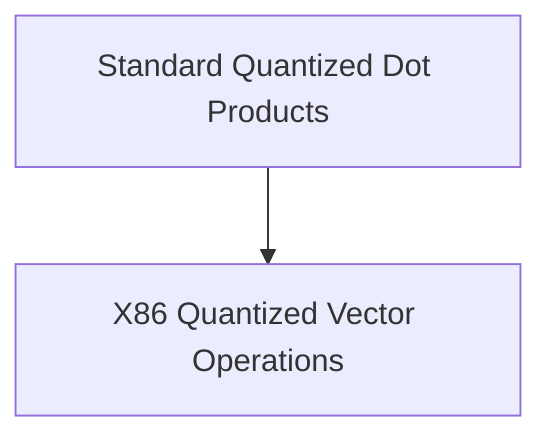

# Standard Quantized Dot Products for x86 CPUs

## Introduction
This module, `standard_quantized_dot_products`, is a critical component within the GGML library, specifically designed for efficient computation of vector dot products on x86 architectures. It provides highly optimized implementations for various standard quantization formats (Q4_0, Q5_0, Q8_0), crucial for accelerating machine learning inference tasks, particularly in scenarios involving quantized models.

## Architecture Overview
The `standard_quantized_dot_products` module is a specialized part of the `ggml_cpu_x86_quants` family. It primarily interacts with lower-level CPU instructions to achieve maximum performance. Its main functional block is dedicated to handling different types of quantized vector dot product operations.

<!-- DIAGRAM_JSON
{
    "direction": "TD",
    "nodes": [
        {"id": "standard_quantized_dot_products", "label": "Standard Quantized Dot Products", "type": "module"},
        {"id": "x86_quantized_vector_operations", "label": "X86 Quantized Vector Operations", "type": "module", "link": "x86_quantized_vector_operations.md"}
    ],
    "edges": [
        {"source": "standard_quantized_dot_products", "target": "x86_quantized_vector_operations"}
    ],
    "groups": []
}
-->

## High-level functionality

The module's core functionality is encapsulated within the `x86_quantized_vector_operations` sub-module.

*   **[X86 Quantized Vector Operations](x86_quantized_vector_operations.md)**: This sub-module contains the highly optimized C functions (`ggml_vec_dot_q4_0_q8_0`, `ggml_vec_dot_q5_0_q8_0`, `ggml_vec_dot_q8_0_q8_0`) that perform dot product calculations for Q4_0, Q5_0, and Q8_0 quantized data against Q8_0 data. These functions utilize specific x86 instruction sets like AVX2, AVX, and SSSE3 to achieve significant performance gains, ensuring efficient processing of quantized tensors.
