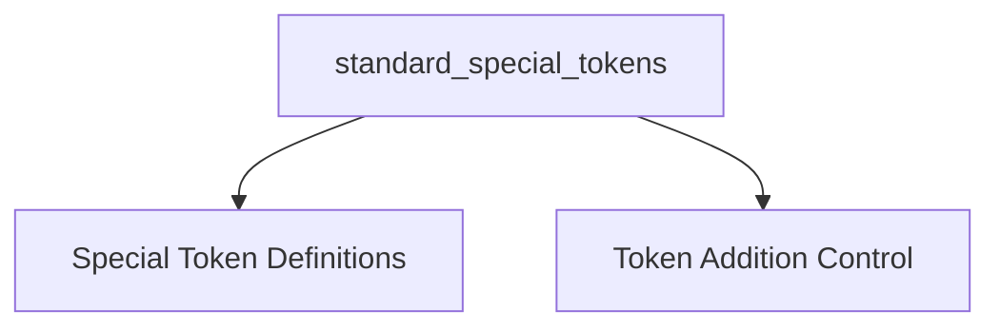

# `standard_special_tokens` Module Documentation

## Introduction

The `standard_special_tokens` module, part of the `llama_cpp_vocab` family, is responsible for defining and managing the standard special tokens used in the `llama.cpp` project. These tokens are crucial for various linguistic operations, indicating the beginning/end of sequences, separation, padding, and other specific contextual cues within the language model.

## Architecture

The `standard_special_tokens` module is structured into two main sub-modules, each handling a distinct aspect of special token management. The overall architecture is designed to provide clear separation of concerns for retrieving token definitions and controlling their automatic addition.

<!-- DIAGRAM_JSON
{
    "direction": "TD",
    "nodes": [
        {"id": "token_definitions", "label": "Special Token Definitions", "type": "module", "link": "token_definitions.md"},
        {"id": "token_management_flags", "label": "Token Addition Control", "type": "module", "link": "token_management_flags.md"}
    ],
    "edges": [
        {"source": "standard_special_tokens_module", "target": "token_definitions"},
        {"source": "standard_special_tokens_module", "target": "token_management_flags"}
    ],
    "groups": [
        {"id": "standard_special_tokens_module", "label": "standard_special_tokens"}
    ]
}
-->

## Sub-modules Overview

### [Special Token Definitions](token_definitions.md)
This sub-module provides functions to retrieve the `llama_token` identifiers for various standard special tokens. These include tokens for the beginning of a sentence (BOS), end of a sentence (EOS), end of text (EOT), classification (CLS), separator (SEP), newline (NL), and padding (PAD).

### [Token Addition Control](token_management_flags.md)
This sub-module contains utilities to determine if the Beginning-of-Sentence (BOS) and End-of-Sentence (EOS) tokens should be automatically added to the token stream, based on the vocabulary configuration. These functions are crucial for maintaining correct sentence structure and model input formatting.