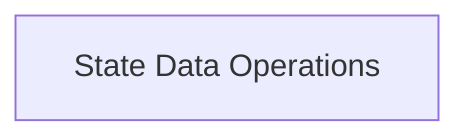

# State Data Management

The `state_data_management` module is a crucial part of the `llama_cpp_context` within the larger `llama_cpp` ecosystem. Its primary purpose is to provide core functionalities for handling the internal state data of the `llama_context`. This includes operations for querying the size of the state, copying state data, and setting state data, ensuring proper management and persistence of the model's operational state.

## Architecture

The `state_data_management` module is composed of a single sub-module, `state_operations`, which encapsulates the core functionalities related to state data handling.

<!-- DIAGRAM_JSON
{
    "direction": "TD",
    "nodes": [
        {"id": "state_operations", "label": "State Data Operations", "type": "module", "link": "state_operations.md"}
    ],
    "edges": [],
    "groups": []
}
-->

## Sub-modules

### [State Data Operations](state_operations.md)

This sub-module is responsible for managing the state data within the `llama_context`. It provides essential functions for copying the current state data, setting the state data from a provided source, and determining the memory size required for the state data. This ensures efficient and accurate manipulation of the model's internal configuration and operational status.