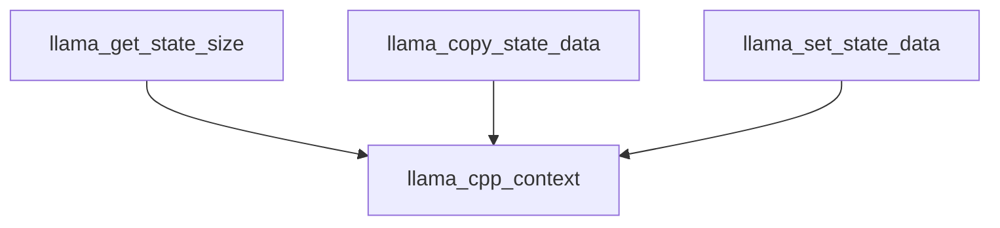

# Module: `state_operations`

## Introduction
The `state_operations` module provides a crucial interface for managing the internal state of a `llama_context` within the `llama.cpp` ecosystem. It offers functionalities to query the state size, copy the current state, and restore a context's state from a previously saved buffer. This is fundamental for operations such as checkpointing, saving/loading sessions, and managing the model's runtime without re-initializing the entire context.

## Purpose and Core Functionality
The primary purpose of the `state_operations` module is to offer a standardized and efficient way to interact with the persistent state of a `llama_context`. This enables applications to maintain and manipulate the model's internal memory and activations across different execution sessions or to revert to previous states.

The module exposes three core functions:

*   **`llama_get_state_size`**: This function is used to determine the exact memory footprint required to store the current internal state of a `llama_context`. This information is vital for allocating an appropriately sized buffer before attempting to save the state.
*   **`llama_copy_state_data`**: Copies the current internal state data of the `llama_context` into a provided byte array. This allows for persistent storage or transfer of the context's state.
*   **`llama_set_state_data`**: Restores the internal state of a `llama_context` from a given byte array. This function is essential for loading a previously saved state, effectively allowing a model to resume computation from a specific point.

## Architecture and Component Relationships

The `state_operations` module acts as a high-level wrapper around lower-level state management functions. Its components directly interact with the `llama_context` structure to perform state-related tasks.

<!-- DIAGRAM_JSON
{
    "direction": "TD",
    "nodes": [
        {"id": "get_state_size", "label": "llama_get_state_size", "type": "component", "link": null},
        {"id": "copy_state_data", "label": "llama_copy_state_data", "type": "component", "link": null},
        {"id": "set_state_data", "label": "llama_set_state_data", "type": "component", "link": null},
        {"id": "llama_cpp_context", "label": "llama_cpp_context", "type": "external", "link": "llama_cpp_context.md"}
    ],
    "edges": [
        {"source": "get_state_size", "target": "llama_cpp_context"},
        {"source": "copy_state_data", "target": "llama_cpp_context"},
        {"source": "set_state_data", "target": "llama_cpp_context"}
    ],
    "groups": []
}
-->

### Component Breakdown:
*   **`llama_get_state_size`**: Retrieves the size of the internal state.
*   **`llama_copy_state_data`**: Copies the state data to a destination buffer.
*   **`llama_set_state_data`**: Sets the state data from a source buffer.

### External Dependencies:
*   **`llama_cpp_context`**: This module heavily relies on the core `llama_context` structure, which it interacts with to perform all state-related operations. For more details, refer to the [llama_cpp_context documentation](llama_cpp_context.md).

## How the Module Fits into the Overall System
The `state_operations` module is a fundamental part of the `llama_cpp_context`'s state management capabilities. It is nested within `state_data_management` which is part of `context_state_management` within the larger `llama_cpp_context` module.

It provides the necessary primitives for higher-level features such as:
*   **Session Persistence**: Saving and loading the entire model state to/from disk, allowing users to pause and resume interactions without re-loading the model or re-processing previous inputs.
*   **Context Checkpointing**: Creating snapshots of the model's state at various points during inference, which can be used for speculative decoding or backtracking in complex generation scenarios.
*   **Efficient State Transfer**: Enabling the transfer of model state between different threads or processes if needed, although direct multi-threading of `llama_context` itself requires careful handling.

By abstracting the complexities of internal state representation, `state_operations` ensures a consistent and robust API for managing the dynamic aspects of the Llama model's runtime environment.