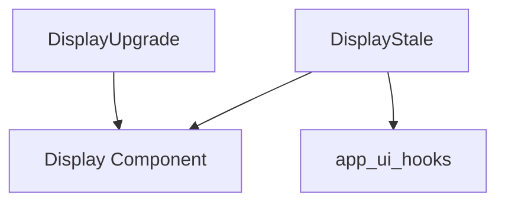

# status_displays Module Documentation

## Introduction

The `status_displays` module provides UI components for displaying various status messages to the user, such as notifications about available model updates or upgrade prompts related to usage limits. These components enhance the user experience by providing timely and actionable information.

## Purpose and Core Functionality

This module contains two primary display components:

### `DisplayStale`

The `DisplayStale` component is responsible for informing the user when a newer version of a model is available. It presents a clear message and an "Update" action button. Upon clicking the "Update" button, the system attempts to force an update of the model, typically by sending an empty message with a `forceUpdate` flag. It also handles scrolling to the bottom of the chat interface if necessary.

### `DisplayUpgrade`

The `DisplayUpgrade` component handles specific error conditions, primarily `usage_limit_upgrade` errors. When such an error occurs, it displays a message prompting the user to upgrade and provides a clickable link (e.g., to the Ollama upgrade page). This component ensures that users are aware of their usage limits and guided towards resolution.

## Architecture and Component Relationships

The `status_displays` module components are designed to be reusable and depend on a foundational `Display` component for consistent UI presentation. They also interact with various hooks for managing application state and sending messages.

### Internal Components

*   `DisplayStale`: Notifies about stale model versions.
*   `DisplayUpgrade`: Prompts users for upgrades based on usage limits or other errors.

### External Dependencies

*   **`display_components`**: Specifically, the `base_display_component` module (likely containing a generic `Display` component) is a critical dependency, providing the foundational UI structure for both `DisplayStale` and `DisplayUpgrade`.
*   **`app_ui_hooks`**: The `DisplayStale` component utilizes hooks like `useSendMessage` and `useIsStreaming` from `app_ui_hooks` to interact with the application's messaging and streaming functionalities.

## How the Module Fits into the Overall System

The `status_displays` module is a crucial part of the `app_ui_components` ecosystem, specifically within `display_components` and `conditional_displays`. It serves as an alert and guidance system, ensuring users are kept informed about important system statuses (like model updates) and potential issues (like usage limits). By providing clear calls to action, it helps maintain a smooth and efficient user experience within the application's UI.

<!-- DIAGRAM_JSON
{
    "direction": "TD",
    "nodes": [
        {"id": "display_stale", "label": "DisplayStale", "type": "component", "link": null},
        {"id": "display_upgrade", "label": "DisplayUpgrade", "type": "component", "link": null},
        {"id": "display_component", "label": "Display Component", "type": "external", "link": "base_display_component.md"},
        {"id": "app_ui_hooks", "label": "app_ui_hooks", "type": "external", "link": "app_ui_hooks.md"}
    ],
    "edges": [
        {"source": "display_stale", "target": "display_component"},
        {"source": "display_upgrade", "target": "display_component"},
        {"source": "display_stale", "target": "app_ui_hooks"}
    ],
    "groups": []
}
-->

