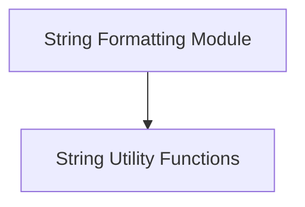

# String Formatting Module Documentation

## Introduction and Purpose

The `string_formatting` module, located within `llama.llama.cpp.common.common.string_manipulation`, provides essential utilities for converting complex data structures into human-readable string formats and for general string manipulation tasks such as joining collections of strings.

This module plays a crucial role in debugging, logging, and user interface display by ensuring that internal data can be easily inspected and presented in a clear, consistent manner.

## Architecture Overview

The `string_formatting` module currently consists of one primary sub-module: `string_utility_functions`. This sub-module encapsulates the core logic for all string-related operations within this module, ensuring a modular and organized structure.

<!-- DIAGRAM_JSON
{
    "direction": "TD",
    "nodes": [
        {"id": "string_utility_functions", "label": "String Utility Functions", "type": "module", "link": "string_utility_functions.md"}
    ],
    "edges": []
}
-->

## Sub-modules

### [String Utility Functions](string_utility_functions.md)
This sub-module contains core functionalities for formatting various data types into strings and for general string manipulation, such as concatenating a list of strings with a specified separator. It includes functions like `string_from` for detailed `llama_batch` representation and `string_join` for array concatenation.