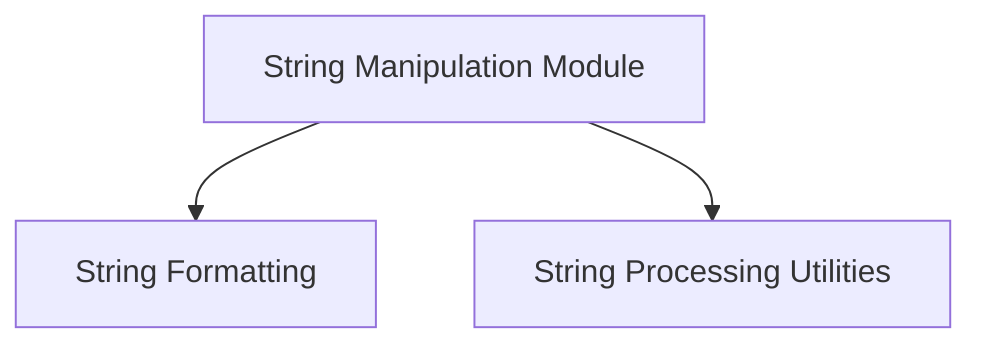

# String Manipulation Module

## Introduction

The `string_manipulation` module provides a collection of utility functions for common string operations within the `llama.cpp.common` framework. These utilities range from formatting data into human-readable strings to complex text processing tasks like detokenization and partial stop phrase detection.

## Architecture Overview

The module is logically divided into two main sub-modules:

1.  **[String Formatting](string_formatting.md)**: Focuses on constructing and combining strings.
2.  **[String Processing Utilities](string_processing.md)**: Handles modification, analysis, and transformation of string data.

These sub-modules interact with the core `llama_context`, `llama_batch`, and `llama_vocab` structures to provide robust string handling capabilities for the LLM inference pipeline.

<!-- DIAGRAM_JSON
{
    "direction": "TD",
    "nodes": [
        {"id": "string_formatting", "label": "String Formatting", "type": "module", "link": "string_formatting.md"},
        {"id": "string_processing", "label": "String Processing Utilities", "type": "module", "link": "string_processing.md"}
    ],
    "edges": [
        {"source": "string_formatting", "target": "string_processing"}
    ],
    "groups": []
}
-->

## Sub-modules

### String Formatting

This sub-module contains functions related to creating and formatting strings from structured data. It includes utilities for generating descriptive strings from `llama_batch` objects and joining multiple strings into a single output.

-   **Further details:** See [string_formatting.md](string_formatting.md)

### String Processing Utilities

This sub-module offers functions for manipulating and analyzing existing strings. It provides capabilities such as removing suffixes, finding partial stop phrases, and converting token sequences back into human-readable text using a `llama_vocab`.

-   **Further details:** See [string_processing.md](string_processing.md)
