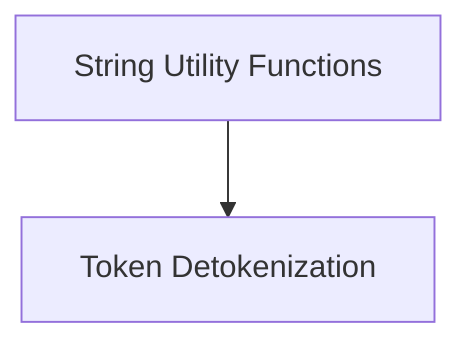

# String Processing Module

## Introduction

The `string_processing` module, part of the `llama_cpp_common` library, provides essential utilities for manipulating and processing strings, particularly in the context of tokenization and detokenization. It offers functionalities to efficiently handle string suffixes, partial stop sequences, and the conversion of tokens back into human-readable text. This module plays a crucial role in preparing and interpreting textual data within the larger system.

## Architecture Overview

The `string_processing` module is logically divided into two main sub-modules:

1.  **String Utility Functions** (`string_utilities.md`): This sub-module focuses on general string manipulation tasks.
2.  **Token Detokenization** (`token_conversion.md`): This sub-module specifically handles the process of converting numerical tokens back into their string representations.

These sub-modules interact to provide a complete set of string processing capabilities.

<!-- DIAGRAM_JSON
{
    "direction": "TD",
    "nodes": [
        {"id": "string_utilities", "label": "String Utility Functions", "type": "module", "link": "string_utilities.md"},
        {"id": "token_conversion", "label": "Token Detokenization", "type": "module", "link": "token_conversion.md"}
    ],
    "edges": [
        {"source": "string_utilities", "target": "token_conversion", "label": "Utilizes"}
    ],
    "groups": []
}
-->

## Sub-modules

-   ### [String Utility Functions](string_utilities.md)
    Provides utility functions for string manipulation, such as suffix removal and partial stop finding.

-   ### [Token Detokenization](token_conversion.md)
    Handles the conversion of a sequence of tokens back into a human-readable string.
