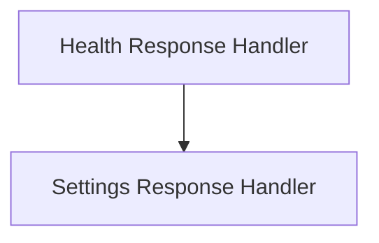

# System Status Responses Module

The `system_status_responses` module is responsible for defining and handling the data structures used for system status and configuration responses within the application's UI. It provides standardized formats for communicating the application's health and its current settings to the user interface.

## Architecture Overview

This module primarily consists of data models for system status information. It acts as a crucial interface between the backend's status reporting and the frontend's consumption of this information.

<!-- DIAGRAM_JSON
{
    "direction": "TD",
    "nodes": [
        {"id": "health_response_handler", "label": "Health Response Handler", "type": "module", "link": "health_response_handler.md"},
        {"id": "settings_response_handler", "label": "Settings Response Handler", "type": "module", "link": "settings_response_handler.md"}
    ],
    "edges": [
        {"source": "health_response_handler", "target": "settings_response_handler", "label": "can be independent"}
    ],
    "groups": []
}
-->

## Sub-modules

### [Health Response Handler](health_response_handler.md)
Handles the parsing of health check responses, indicating the system's operational status.

### [Settings Response Handler](settings_response_handler.md)
Manages the parsing and handling of application settings responses from the backend.
