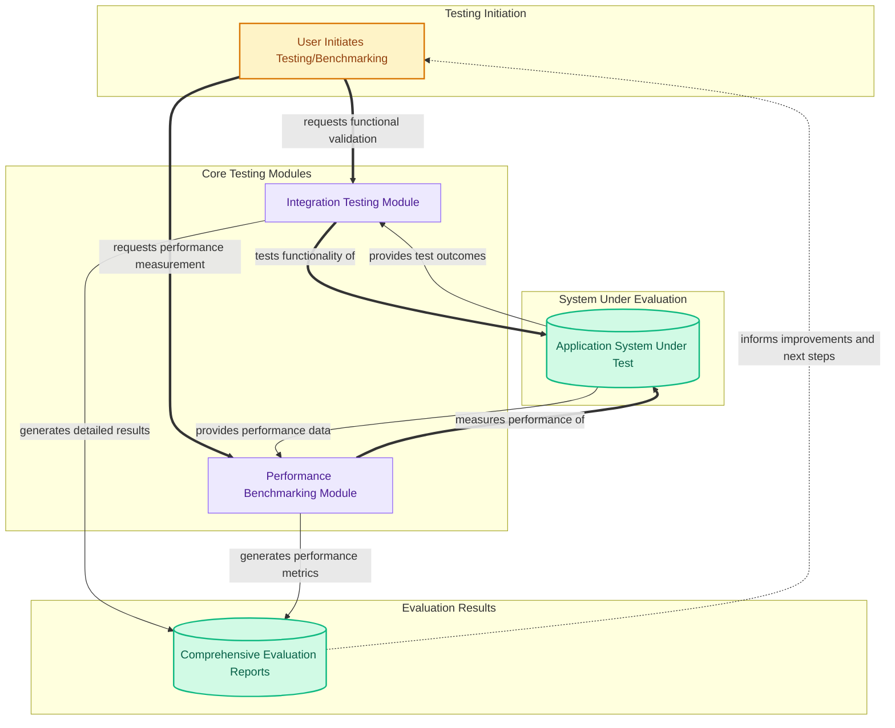

The `system_testing_and_benchmarking` module is dedicated to ensuring the overall quality, reliability, and performance of the application. It provides a comprehensive suite of tools and tests for evaluating the system's functional correctness, API behavior, concurrency handling, multimodal capabilities, and core machine learning operations. For users, this module guarantees that the application's features work as expected under various conditions and that its performance meets required standards, leading to a stable and efficient user experience.

### How it Works

The module orchestrates two primary functions: **Integration Testing** and **Performance Benchmarking**. Integration testing validates the end-to-end functionality of various API endpoints, model lifecycle management, concurrency, and multimodal features. Performance benchmarking, on the other hand, measures and optimizes the system's speed, resource utilization, and scalability, including granular performance tests for core machine learning transformations. Together, these components provide a holistic view of the system's health and efficiency, feeding back insights for continuous improvement.

### Core Components Documentation

*   **Integration Testing**: Provides a comprehensive suite of tests for API endpoints, model lifecycle, concurrency, and multimodal capabilities.
    *   [integration_testing.md](integration_testing.md)
*   **Performance Benchmarking**: Offers tools and tests for evaluating model and core machine learning transformation performance.
    *   [performance_benchmarking.md](performance_benchmarking.md)