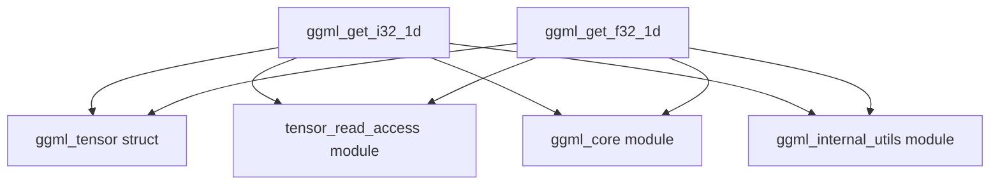

# tensor_1d_read_ops Module Documentation

## Introduction

The `tensor_1d_read_ops` module provides core functionalities for reading single elements (integers and floating-point numbers) from 1-dimensional GGML tensors. It offers robust type handling and can transparently manage both contiguous and non-contiguous tensor data layouts.

## Architecture and Component Relationships

This module is a leaf module within the `ggml_cpu_backend`'s tensor data access hierarchy. It sits within `tensor_read_access`, which is part of `tensor_data_access` under `cpu_graph_and_data_access`. Its functions are essential for retrieving specific values from tensors in a CPU-bound execution environment.

<!-- DIAGRAM_JSON
{
    "direction": "TD",
    "nodes": [
        {"id": "ggml_get_i32_1d", "label": "ggml_get_i32_1d", "type": "component", "link": null},
        {"id": "ggml_get_f32_1d", "label": "ggml_get_f32_1d", "type": "component", "link": null},
        {"id": "ggml_tensor_struct", "label": "ggml_tensor struct", "type": "external", "link": "ggml_core.md"},
        {"id": "tensor_read_access_mod", "label": "tensor_read_access module", "type": "external", "link": "tensor_read_access.md"},
        {"id": "ggml_core_mod", "label": "ggml_core module", "type": "external", "link": "ggml_core.md"},
        {"id": "ggml_internal_utils_mod", "label": "ggml_internal_utils module", "type": "external", "link": "ggml_internal_utils.md"}
    ],
    "edges": [
        {"source": "ggml_get_i32_1d", "target": "ggml_tensor_struct"},
        {"source": "ggml_get_i32_1d", "target": "tensor_read_access_mod"},
        {"source": "ggml_get_i32_1d", "target": "ggml_core_mod"},
        {"source": "ggml_get_i32_1d", "target": "ggml_internal_utils_mod"},
        {"source": "ggml_get_f32_1d", "target": "ggml_tensor_struct"},
        {"source": "ggml_get_f32_1d", "target": "tensor_read_access_mod"},
        {"source": "ggml_get_f32_1d", "target": "ggml_core_mod"},
        {"source": "ggml_get_f32_1d", "target": "ggml_internal_utils_mod"}
    ],
    "groups": []
}
-->



### Module Overview

The `tensor_1d_read_ops` module primarily exposes two functions: `ggml_get_i32_1d` and `ggml_get_f32_1d`. These functions are responsible for safely retrieving an integer or a floating-point value, respectively, from a 1D index of a given `ggml_tensor`. They abstract away the underlying tensor type and storage details, providing a unified access mechanism.

For non-contiguous tensors, these functions delegate to their N-dimensional counterparts (`ggml_get_i32_nd` and `ggml_get_f32_nd`) after unraveling the 1D index, which are managed by the [tensor_read_access module](tensor_read_access.md).

### How it fits into the overall system

This module is a crucial low-level component within the GGML CPU backend for tensor data manipulation. It provides direct, indexed read access to tensor data, which is fundamental for various tensor operations, debugging, and data inspection within the GGML framework. It relies on the [ggml_core module](ggml_core.md) for tensor structure definitions (`ggml_tensor`), contiguity checks (`ggml_is_contiguous`), index unraveling (`ggml_unravel_index`), and type conversion utilities (`GGML_CPU_FP16_TO_FP32`, `GGML_BF16_TO_FP32`). Assertions and error handling are provided by the [ggml_internal_utils module](ggml_internal_utils.md).

## Core Components

### ggml_get_i32_1d

`ggml_get_i32_1d` is a function designed to retrieve a 32-bit integer value from a specified 1D index within a `ggml_tensor`. It handles various tensor data types, automatically converting `fp16`, `bf16`, and `f32` to `int32` where appropriate.

```c
int32_t ggml_get_i32_1d(const struct ggml_tensor * tensor, int i) {
    if (!ggml_is_contiguous(tensor)) {
        int64_t id[4] = { 0, 0, 0, 0 };
        ggml_unravel_index(tensor, i, &id[0], &id[1], &id[2], &id[3]);
        return ggml_get_i32_nd(tensor, id[0], id[1], id[2], id[3]);
    }
    switch (tensor->type) {
        case GGML_TYPE_I8:
            {
                GGML_ASSERT(tensor->nb[0] == sizeof(int8_t));
                return ((int8_t *)(tensor->data))[i];
            }
        case GGML_TYPE_I16:
            {
                GGML_ASSERT(tensor->nb[0] == sizeof(int16_t));
                return ((int16_t *)(tensor->data))[i];
            }
        case GGML_TYPE_I32:
            {
                GGML_ASSERT(tensor->nb[0] == sizeof(int32_t));
                return ((int32_t *)(tensor->data))[i];
            }
        case GGML_TYPE_F16:
            {
                GGML_ASSERT(tensor->nb[0] == sizeof(ggml_fp16_t));
                return GGML_CPU_FP16_TO_FP32(((ggml_fp16_t *)(tensor->data))[i]);
            }
        case GGML_TYPE_BF16:
            {
                GGML_ASSERT(tensor->nb[0] == sizeof(ggml_bf16_t));
                return GGML_BF16_TO_FP32(((ggml_bf16_t *)(tensor->data))[i]);
            }
        case GGML_TYPE_F32:
            {
                GGML_ASSERT(tensor->nb[0] == sizeof(float));
                return ((float *)(tensor->data))[i];
            }
        default:
            {
                GGML_ABORT("fatal error");
            }
    }
}
```

### ggml_get_f32_1d

`ggml_get_f32_1d` is a function designed to retrieve a 32-bit floating-point value from a specified 1D index within a `ggml_tensor`. Similar to `ggml_get_i32_1d`, it handles various tensor data types, automatically converting `i8`, `i16`, `i32`, `fp16`, and `bf16` to `f32`.

```c
float ggml_get_f32_1d(const struct ggml_tensor * tensor, int i) {
    if (!ggml_is_contiguous(tensor)) {
        int64_t id[4] = { 0, 0, 0, 0 };
        ggml_unravel_index(tensor, i, &id[0], &id[1], &id[2], &id[3]);
        return ggml_get_f32_nd(tensor, id[0], id[1], id[2], id[3]);
    }
    switch (tensor->type) {
        case GGML_TYPE_I8:
            {
                return ((int8_t *)(tensor->data))[i];
            }
        case GGML_TYPE_I16:
            {
                return ((int16_t *)(tensor->data))[i];
            }
        case GGML_TYPE_I32:
            {
                return ((int32_t *)(tensor->data))[i];
            }
        case GGML_TYPE_F16:
            {
                return GGML_CPU_FP16_TO_FP32(((ggml_fp16_t *)(tensor->data))[i]);
            }
        case GGML_TYPE_BF16:
            {
                return GGML_BF16_TO_FP32(((ggml_bf16_t *)(tensor->data))[i]);
            }
        case GGML_TYPE_F32:
            {
                return ((float *)(tensor->data))[i];
            }
        default:
            {
                GGML_ABORT("fatal error");
            }
    }
}
```