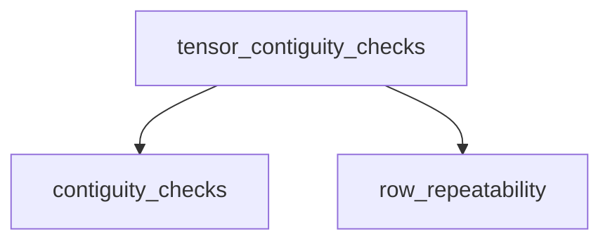

# tensor_contiguity_checks Module Documentation

## Introduction and Purpose

The `tensor_contiguity_checks` module is a crucial part of the `ggml_tensor_properties` sub-system within the `ggml_core` module. Its primary purpose is to provide a set of utility functions for verifying the memory contiguity and layout characteristics of `ggml_tensor` structures. These checks are fundamental for optimizing tensor operations, ensuring correct data access patterns, and preventing performance bottlenecks or errors related to memory organization.

## Architecture Overview

The module is logically divided into two main sub-modules: `contiguity_checks` and `row_repeatability`. These sub-modules encapsulate related functionalities, making the codebase organized and easier to maintain. The `contiguity_checks` sub-module focuses on various aspects of tensor contiguity, while `row_repeatability` handles specific checks related to the ability to repeat tensor rows in certain operations.

<!-- DIAGRAM_JSON
{
    "direction": "TD",
    "nodes": [
        {"id": "contiguity_checks", "label": "Tensor Contiguity Checks", "type": "module", "link": "contiguity_checks.md"},
        {"id": "row_repeatability", "label": "Row Repeatability Utilities", "type": "module", "link": "row_repeatability.md"}
    ],
    "edges": [
        {"source": "tensor_contiguity_checks", "target": "contiguity_checks"},
        {"source": "tensor_contiguity_checks", "target": "row_repeatability"}
    ],
    "groups": []
}
-->

## High-Level Functionality

### [Tensor Contiguity Checks](contiguity_checks.md)
This sub-module provides functions to verify the contiguous memory layout of tensors along different dimensions. It includes checks for overall contiguous allocation, and contiguity along specific dimensions (e.g., `ggml_is_contiguous_1`, `ggml_is_contiguous_2`, and `ggml_is_contiguous_rows`). These functions are essential for determining if a tensor's data is stored in a linear, uninterrupted block of memory, which is crucial for efficient memory access and certain low-level operations.

### [Row Repeatability Utilities](row_repeatability.md)
This sub-module contains utilities to determine if tensor rows can be repeated, primarily used in operations involving repeating patterns. The `ggml_can_repeat_rows` function, for instance, checks if the dimensions of two tensors allow for row repetition, which is vital for operations like broadcasting or specialized matrix multiplications where rows are logically duplicated to fit dimension requirements.