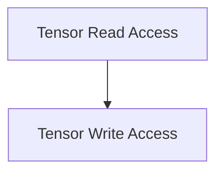

# Tensor Data Access Module

## Introduction

The `tensor_data_access` module, part of the `ggml_cpu_backend`, provides essential functionalities for reading and writing data to 1D GGML tensors. It offers type-safe and memory-layout-aware functions to interact with tensor data, supporting various integer and floating-point types. This module is critical for operations that require direct manipulation of tensor elements on the CPU.

## Architecture Overview

The `tensor_data_access` module is composed of two primary sub-modules:

*   **Tensor Read Access**: Handles the retrieval of data from tensors.
*   **Tensor Write Access**: Manages the modification and storage of data into tensors.

These sub-modules work together to provide a comprehensive interface for 1D tensor data manipulation, abstracting away the underlying memory layout (contiguous vs. non-contiguous).

<!-- DIAGRAM_JSON
{
    "direction": "TD",
    "nodes": [
        {"id": "tensor_read_access", "label": "Tensor Read Operations", "type": "module", "link": "tensor_read_access.md"},
        {"id": "tensor_write_access", "label": "Tensor Write Operations", "type": "module", "link": "tensor_write_access.md"}
    ],
    "edges": [
        {"source": "tensor_read_access", "target": "tensor_write_access"}
    ],
    "groups": []
}
-->

## Sub-modules

### [Tensor Read Access](tensor_read_access.md)
This sub-module provides functions for safely reading integer and floating-point values from 1D GGML tensors, accommodating different internal data types and memory configurations.

### [Tensor Write Access](tensor_write_access.md)
This sub-module contains functions for writing integer and floating-point values to 1D GGML tensors, ensuring proper data conversion and handling of both contiguous and non-contiguous memory layouts.