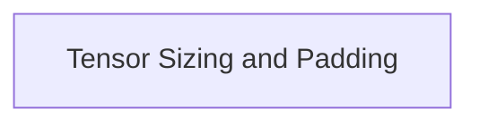

# Tensor Memory Utilities

## Introduction
The `tensor_memory_utilities` module provides essential functions for managing and querying memory allocation for tensors within the GGML framework. It specifically focuses on calculating memory requirements, including padding, and identifying the largest tensor in a given context to optimize memory usage and alignment.

## Architecture Overview
This module is a part of the `ggml_tensor_properties` module, specifically within its `tensor_size_and_padding` sub-module. It interacts directly with GGML tensor structures and contexts to perform its memory calculations. The module is designed to be lightweight and efficient, providing core utilities for memory management without introducing complex dependencies.

<!-- DIAGRAM_JSON
{
    "direction": "TD",
    "nodes": [
        {"id": "tensor_sizing", "label": "Tensor Sizing and Padding", "type": "module", "link": "tensor_sizing.md"}
    ],
    "edges": []
}
-->

## Sub-modules
* [Tensor Sizing and Padding](tensor_sizing.md): Contains functions for calculating padded tensor sizes and determining the maximum tensor size within a GGML context.