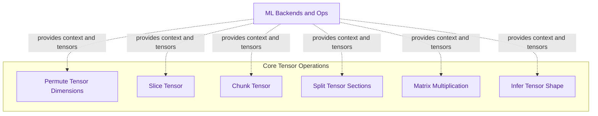

# Tensor Operations
This module provides fundamental tensor manipulation functions such as permutation, slicing, chunking, splitting, matrix multiplication, and shape inference, crucial for numerical computations within the GGML backend.

<!-- DIAGRAM_JSON
{
    "direction": "TD",
    "nodes": [
        {
            "id": "permute_op",
            "label": "Permute Tensor Dimensions",
            "type": "component",
            "link": null
        },
        {
            "id": "slice_op",
            "label": "Slice Tensor",
            "type": "component",
            "link": null
        },
        {
            "id": "chunk_op",
            "label": "Chunk Tensor",
            "type": "component",
            "link": null
        },
        {
            "id": "split_sections_op",
            "label": "Split Tensor Sections",
            "type": "component",
            "link": null
        },
        {
            "id": "mulmat_op",
            "label": "Matrix Multiplication",
            "type": "component",
            "link": null
        },
        {
            "id": "infer_shape_op",
            "label": "Infer Tensor Shape",
            "type": "component",
            "link": null
        },
        {
            "id": "ml_backend",
            "label": "ML Backends and Ops",
            "type": "external",
            "link": "ml_backends_and_ops.md"
        }
    ],
    "edges": [
        {
            "source": "ml_backend",
            "target": "permute_op",
            "label": "provides context and tensors"
        },
        {
            "source": "ml_backend",
            "target": "slice_op",
            "label": "provides context and tensors"
        },
        {
            "source": "ml_backend",
            "target": "chunk_op",
            "label": "provides context and tensors"
        },
        {
            "source": "ml_backend",
            "target": "split_sections_op",
            "label": "provides context and tensors"
        },
        {
            "source": "ml_backend",
            "target": "mulmat_op",
            "label": "provides context and tensors"
        },
        {
            "source": "ml_backend",
            "target": "infer_shape_op",
            "label": "provides context and tensors"
        }
    ],
    "groups": [
        {
            "id": "tensor_ops_group",
            "label": "Core Tensor Operations",
            "role": "analytical",
            "nodes": [
                "permute_op",
                "slice_op",
                "chunk_op",
                "split_sections_op",
                "mulmat_op",
                "infer_shape_op"
            ]
        }
    ]
}
-->
