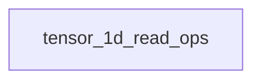

# tensor_read_access Module Documentation

## Introduction

The `tensor_read_access` module is a crucial component within the `ggml_cpu_backend`'s data access layer. Its primary responsibility is to provide efficient and type-safe methods for reading single-dimensional tensor data from various `ggml` tensor types, converting them into standard integer (`int32_t`) or floating-point (`float`) formats.

This module ensures that higher-level operations can reliably retrieve tensor values regardless of their underlying storage type (e.g., `I8`, `F16`, `F32`), handling necessary type conversions and checks for contiguous memory access.

## Architecture Overview

The `tensor_read_access` module resides within the `ggml_cpu_backend`, specifically under the `cpu_graph_and_data_access` -> `tensor_data_access` hierarchy. It works in conjunction with modules like `tensor_write_access` to provide a comprehensive interface for managing tensor data on the CPU.

The module's core functionality is encapsulated within the `tensor_1d_read_ops` sub-module, which handles the actual data retrieval and type conversion logic.

<!-- DIAGRAM_JSON
{
    "direction": "TD",
    "nodes": [
        {"id": "tensor_1d_read_ops", "label": "1D Tensor Read Operations", "type": "module", "link": "tensor_1d_read_ops.md"}
    ],
    "edges": [],
    "groups": []
}
-->

## Sub-modules

### [1D Tensor Read Operations](tensor_1d_read_ops.md)

This sub-module contains the core functions for reading single-dimensional tensor data. It abstracts away the complexities of different tensor data types, providing unified interfaces to retrieve values as `int32_t` or `float`.
