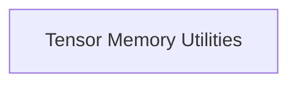

# Tensor Size and Padding Module

## Introduction
The `tensor_size_and_padding` module, part of `ggml_tensor_properties`, is responsible for providing core utilities related to calculating the memory footprint of tensors within the GGML framework. This includes functions to determine the padded size of individual tensors and to identify the largest tensor by memory consumption within a given context, ensuring efficient memory management and allocation.

## Architecture Overview
The module currently comprises a single sub-module, `tensor_memory_utilities`, which encapsulates the core logic for tensor size calculations. This sub-module exposes functions necessary for querying tensor memory properties.

<!-- DIAGRAM_JSON
{
    "direction": "TD",
    "nodes": [
        {"id": "tensor_memory_utilities", "label": "Tensor Memory Utilities", "type": "module", "link": "tensor_memory_utilities.md"}
    ],
    "edges": [],
    "groups": []
}
-->

## Sub-modules

*   ### [Tensor Memory Utilities](tensor_memory_utilities.md)
    This sub-module provides critical functions for calculating tensor sizes and padding, as well as determining the maximum tensor size within a GGML context. It helps in understanding memory allocation requirements and optimizing memory usage.
