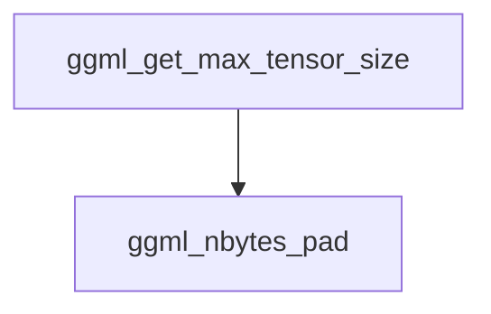

# Tensor Sizing Module Documentation

## Introduction
The `tensor_sizing` module within the `ggml_tensor_properties` sub-module is responsible for calculating and managing the memory footprint of tensors. It provides utilities to determine the actual size of tensors in memory, accounting for padding and alignment requirements, and to identify the largest tensor within a given GGML context.

## Core Functionality

### `ggml_nbytes_pad`
This function calculates the total number of bytes a tensor will occupy in memory, including any necessary padding to ensure proper memory alignment (`GGML_MEM_ALIGN`). This is crucial for efficient memory access and performance within the GGML framework.

**Component ID**: `ml.backend.ggml.ggml.src.ggml.ggml_nbytes_pad`

```c
size_t ggml_nbytes_pad(const struct ggml_tensor * tensor) {
    return GGML_PAD(ggml_nbytes(tensor), GGML_MEM_ALIGN);
}
```

### `ggml_get_max_tensor_size`
This utility function iterates through all tensors currently managed within a `ggml_context` and determines the maximum memory size (in bytes) occupied by any individual tensor. This can be useful for memory allocation strategies and profiling.

**Component ID**: `ml.backend.ggml.ggml.src.ggml.ggml_get_max_tensor_size`

```c
size_t ggml_get_max_tensor_size(const struct ggml_context * ctx) {
    size_t max_size = 0;

    for (struct ggml_tensor * tensor = ggml_get_first_tensor(ctx); tensor != NULL; tensor = ggml_get_next_tensor(ctx, tensor)) {
        size_t bytes = ggml_nbytes(tensor);
        max_size = MAX(max_size, bytes);
    }

    return max_size;
}
```

## Architecture Diagram

The following diagram illustrates the relationship between the components within the `tensor_sizing` module. `ggml_get_max_tensor_size` depends on `ggml_nbytes` (which is internally used by `ggml_nbytes_pad` and is implicitly part of the tensor sizing logic).

<!-- DIAGRAM_JSON
{
    "direction": "TD",
    "nodes": [
        {"id": "ggml_nbytes_pad", "label": "ggml_nbytes_pad", "type": "module", "link": "tensor_sizing.md#ggml_nbytes_pad"},
        {"id": "ggml_get_max_tensor_size", "label": "ggml_get_max_tensor_size", "type": "module", "link": "tensor_sizing.md#ggml_get_max_tensor_size"}
    ],
    "edges": [
        {"source": "ggml_get_max_tensor_size", "target": "ggml_nbytes_pad", "label": "uses indirectly (via ggml_nbytes)"}
    ],
    "groups": []
}
-->

