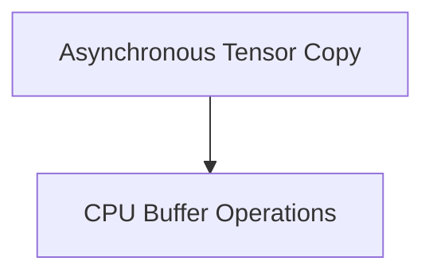

# Tensor Transfer Module

## Introduction and Purpose

The `tensor_transfer` module is a critical component within the `ggml_backend_core`, specifically focusing on the efficient and reliable transfer of tensor data between different backend environments. It provides functionalities for both asynchronous and synchronous tensor copying, as well as specific operations for managing CPU-based tensor buffers. This module ensures that tensor data can be moved seamlessly across various hardware accelerators and CPU memory, optimizing performance for machine learning computations.

## Architecture Overview

The `tensor_transfer` module is organized into sub-modules that handle distinct aspects of tensor data movement and buffer management. It interacts with different backends to facilitate data exchange.

<!-- DIAGRAM_JSON
{
    "direction": "TD",
    "nodes": [
        {"id": "asynchronous_tensor_copy", "label": "Asynchronous Tensor Copy", "type": "module", "link": "asynchronous_tensor_copy.md"},
        {"id": "cpu_buffer_operations", "label": "CPU Buffer Operations", "type": "module", "link": "cpu_buffer_operations.md"}
    ],
    "edges": [
        {"source": "asynchronous_tensor_copy", "target": "cpu_buffer_operations"}
    ],
    "groups": []
}
-->

## High-Level Functionality

### [Asynchronous Tensor Copy](asynchronous_tensor_copy.md)
This sub-module is responsible for handling the copying of tensor data between different `ggml` backends. It prioritizes asynchronous copy operations for performance, but includes a robust fallback mechanism to perform synchronous copies after ensuring both source and destination backends are synchronized. This ensures data consistency and reliability during transfers.

### [CPU Buffer Operations](cpu_buffer_operations.md)
This sub-module provides essential functionalities for managing tensor data within CPU memory. It includes operations for copying tensor content between buffers, particularly when the source buffer resides in host memory. Additionally, it offers utilities for initializing new CPU backend buffers from raw memory pointers, ensuring proper memory alignment for optimal performance.

## Module Relationships

The `tensor_transfer` module is part of the `ggml_backend_core` module, specifically within its `data_transfer_and_comparison` sub-module. It relies on the core `ggml_backend_core` functionalities for backend synchronization and general tensor operations. Its operations are fundamental for data movement in multi-backend `ggml` environments, enabling tensors to be processed on appropriate devices (e.g., CPU, GPU) as needed by the computation graph. This module plays a crucial role in the overall data flow and performance of the `ggml` ecosystem.
