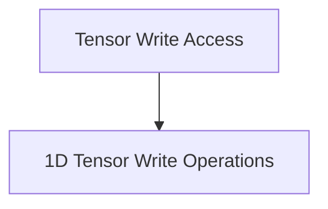

# Tensor Write Access Module Documentation

## Introduction

The `tensor_write_access` module is a critical component within the `ggml-cpu` backend, specifically designed to handle the direct writing of data to tensor structures. It provides fundamental operations for manipulating tensor data, accommodating various data types and ensuring proper handling of both contiguous and non-contiguous memory layouts. This module is essential for data initialization and modification operations within the GGML framework.

## Architecture Overview

The `tensor_write_access` module is structured around specialized sub-modules that abstract the complexities of writing different data types to tensors. The primary sub-module focuses on 1-dimensional tensor write operations.

<!-- DIAGRAM_JSON
{
    "direction": "TD",
    "nodes": [
        {"id": "tensor_write_access", "label": "Tensor Write Access", "type": "module"},
        {"id": "tensor_1d_write_ops", "label": "1D Tensor Write Operations", "type": "module", "link": "tensor_1d_write_ops.md"}
    ],
    "edges": [
        {"source": "tensor_write_access", "target": "tensor_1d_write_ops"}
    ],
    "groups": []
}
-->

## Sub-modules

### [1D Tensor Write Operations (tensor_1d_write_ops)](tensor_1d_write_ops.md)

This sub-module provides the core functions for writing integer and float values to 1-dimensional tensors. It abstracts the underlying data type conversion and memory layout considerations, ensuring that values are correctly stored regardless of the tensor's internal representation (e.g., `GGML_TYPE_I8`, `GGML_TYPE_F32`, `GGML_TYPE_F16`). It also handles non-contiguous tensors by delegating to N-dimensional write functions when necessary. This allows for a simplified interface for developers to update tensor data.