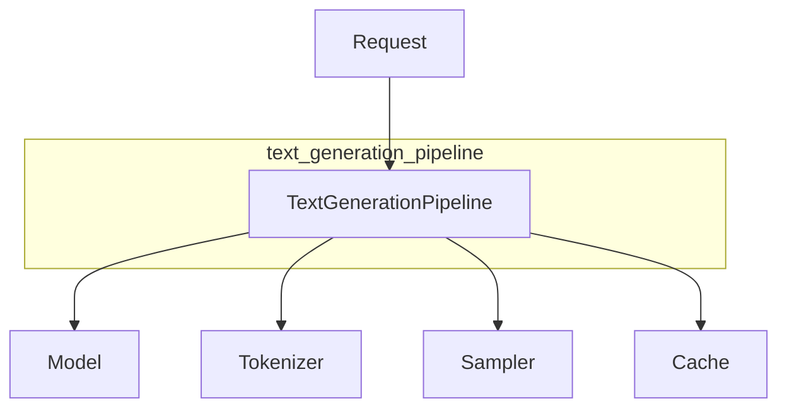

# text_generation_pipeline
This module provides a text generation pipeline, handling prompt processing, tokenization, model inference, and memory management for generating text based on a given prompt and options.

<!-- DIAGRAM_JSON
{
  "nodes": [
    {"id": "text_generation_pipeline", "label": "text_generation_pipeline", "type": "module"},
    {"id": "TextGenerationPipeline", "label": "TextGenerationPipeline", "type": "component"},
    {"id": "Model", "label": "Model", "type": "dependency"},
    {"id": "Tokenizer", "label": "Tokenizer", "type": "dependency"},
    {"id": "Sampler", "label": "Sampler", "type": "dependency"},
    {"id": "Cache", "label": "Cache", "type": "dependency"},
    {"id": "Request", "label": "Request", "type": "data"}
  ],
  "edges": [
    {"source": "TextGenerationPipeline", "target": "Model", "label": "uses"},
    {"source": "TextGenerationPipeline", "target": "Tokenizer", "label": "uses"},
    {"source": "TextGenerationPipeline", "target": "Sampler", "label": "uses"},
    {"source": "TextGenerationPipeline", "target": "Cache", "label": "uses"},
    {"source": "Request", "target": "TextGenerationPipeline", "label": "input"}
  ],
  "groups": [
    {"id": "module_text_generation_pipeline", "label": "text_generation_pipeline", "nodes": ["TextGenerationPipeline"]}
  ]
}
-->
