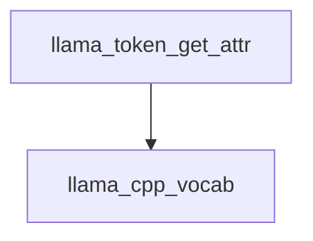

# `token_attribute_retrieval`

This module provides a core utility function for retrieving attributes associated with a specific token within the `llama.cpp` vocabulary system. It acts as a direct interface to query token properties stored within the `llama_vocab` structure.

## Module Architecture and Component Relationships

The `token_attribute_retrieval` module contains a single, focused component that abstracts the process of fetching token attributes. It directly interacts with the `llama_vocab` data structure, which is managed by the parent module, `llama_cpp_vocab`.

<!-- DIAGRAM_JSON
{
    "direction": "TD",
    "nodes": [
        {"id": "llama_token_get_attr", "label": "llama_token_get_attr", "type": "component", "link": null},
        {"id": "llama_cpp_vocab", "label": "llama_cpp_vocab", "type": "external", "link": "llama_cpp_vocab.md"}
    ],
    "edges": [
        {"source": "llama_token_get_attr", "target": "llama_cpp_vocab"}
    ],
    "groups": []
}
-->


<style>
.external_node {
    fill: #C0C0C0;
}
</style>

### Core Components

#### `llama.llama.cpp.src.llama-vocab.llama_token_get_attr`

This function is the primary entry point for retrieving a token's attributes.

```cpp
enum llama_token_attr llama_token_get_attr(const struct llama_vocab * vocab, llama_token token) {
    return llama_vocab_get_attr(vocab, token);
}
```

-   **Purpose**: To retrieve the enumerated attributes of a given `llama_token` from a provided `llama_vocab` instance.
-   **Parameters**:
    -   `vocab`: A pointer to the `llama_vocab` structure containing the vocabulary information.
    -   `token`: The `llama_token` for which attributes are to be retrieved.
-   **Return Value**: An `enum llama_token_attr` representing the attributes of the specified token.
-   **Dependencies**: This function directly calls `llama_vocab_get_attr`, indicating a direct reliance on the internal implementation of the [llama_cpp_vocab](llama_cpp_vocab.md) module for vocabulary management and attribute storage.

## How the Module Fits into the Overall System

The `token_attribute_retrieval` module is a fundamental part of the `llama_cpp_vocab` ecosystem. It provides a standardized and abstracted way to query properties of individual tokens. This is crucial for various functionalities within the `llama.cpp` library, such as:

-   **Tokenization Logic**: Understanding token attributes can influence how tokens are processed during encoding and decoding.
-   **Grammar Enforcement**: Attribute checks can be used in conjunction with grammar parsing to ensure token validity.
-   **Special Token Handling**: Identifying special tokens (e.g., BOS, EOS, padding) based on their attributes.

By encapsulating the attribute retrieval logic, this module ensures consistency and simplifies the development of higher-level components that need to interact with token properties. It sits low in the hierarchy, providing a basic building block for more complex vocabulary-related operations.