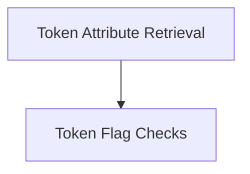

# Token Attributes and Flags Module

## Introduction

The `token_attributes_and_flags` module, part of the `llama_cpp_vocab` component, is responsible for providing core functionalities related to retrieving attributes and checking specific flags for tokens within the vocabulary. This module serves as a crucial interface for understanding the nature and behavior of individual tokens, which is essential for various natural language processing and generation tasks.

## Architecture Overview

The `token_attributes_and_flags` module is composed of two primary sub-modules:

*   **[Token Attribute Retrieval](token_attribute_retrieval.md)**: Focuses on fetching general attributes associated with tokens.
*   **[Token Flag Checks](token_flag_checks.md)**: Provides utilities for verifying specific boolean flags of tokens, such as whether a token marks the end of generation or is a control token.

These sub-modules interact with the underlying `llama_vocab` structure to access and interpret token information, ensuring a consistent and efficient way to query token properties.

<!-- DIAGRAM_JSON
{
    "direction": "TD",
    "nodes": [
        {"id": "token_attribute_retrieval", "label": "Token Attribute Retrieval", "type": "module", "link": "token_attribute_retrieval.md"},
        {"id": "token_flag_checks", "label": "Token Flag Checks", "type": "module", "link": "token_flag_checks.md"}
    ],
    "edges": [
        {"source": "token_attribute_retrieval", "target": "token_flag_checks"}
    ],
    "groups": []
}
-->

## Sub-module Functionality

### Token Attribute Retrieval ([`token_attribute_retrieval.md`](token_attribute_retrieval.md))
This sub-module provides the core function `llama_token_get_attr` to retrieve the general attributes of a token. These attributes define the fundamental characteristics and type of a token within the `llama_vocab` system.

### Token Flag Checks ([`token_flag_checks.md`](token_flag_checks.md))
This sub-module offers specific boolean functions like `llama_token_is_eog` and `llama_token_is_control` to determine particular flags or states of a token. These flags are crucial for parsing, generation control, and understanding the special roles certain tokens play in the language model's operation.
