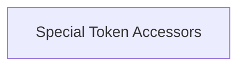

# Token Definitions Module

## Introduction

The `token_definitions` module provides a set of utility functions for accessing special tokens within the `llama_vocab` structure. These tokens are fundamental for various natural language processing tasks, including marking the beginning/end of a sentence, classification, and separation of segments.

## Architecture Overview

This module primarily acts as an interface to retrieve predefined special tokens from the core vocabulary. It encapsulates the direct calls to the `llama_vocab` functions, offering a consistent API for token access.

<!-- DIAGRAM_JSON
{
    "direction": "TD",
    "nodes": [
        {"id": "special_token_accessors", "label": "Special Token Accessors", "type": "module", "link": "special_token_accessors.md"}
    ],
    "edges": [],
    "groups": []
}
-->

## Sub-modules

### [Special Token Accessors](special_token_accessors.md)
This sub-module contains functions such as `llama_token_bos`, `llama_token_eos`, `llama_token_eot`, `llama_token_cls`, `llama_token_sep`, `llama_token_nl`, and `llama_token_pad`, which are used to retrieve their respective special token IDs from the vocabulary.