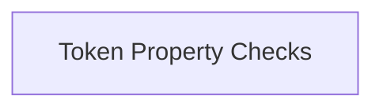

# token_flag_checks Module Documentation

## Introduction

The `token_flag_checks` module is a crucial component within the `llama_cpp_vocab` ecosystem, specifically nested under `token_attributes_and_flags`. Its primary role is to provide helper functions for quickly identifying specific characteristics of LLaMA tokens, such as whether a token signifies the end of a generation sequence or if it is a control token. This module acts as a wrapper around core vocabulary functions, offering a simplified interface for common token property checks.

## Architecture Overview

The `token_flag_checks` module directly interfaces with the underlying `llama_vocab` structure to perform its checks. It encapsulates low-level vocabulary queries into easily consumable functions, ensuring consistency and ease of use for higher-level modules that need to interpret token properties.

<!-- DIAGRAM_JSON
{
    "direction": "TD",
    "nodes": [
        {"id": "token_property_checks", "label": "Token Property Checks", "type": "module", "link": "token_property_checks.md"}
    ],
    "edges": [],
    "groups": []
}
-->

## Sub-modules

### [token_property_checks](token_property_checks.md)
This sub-module contains the core logic for checking various flags and properties of individual LLaMA tokens. It provides functions to determine if a token is an end-of-generation marker or a control token, facilitating the processing and interpretation of token streams.
