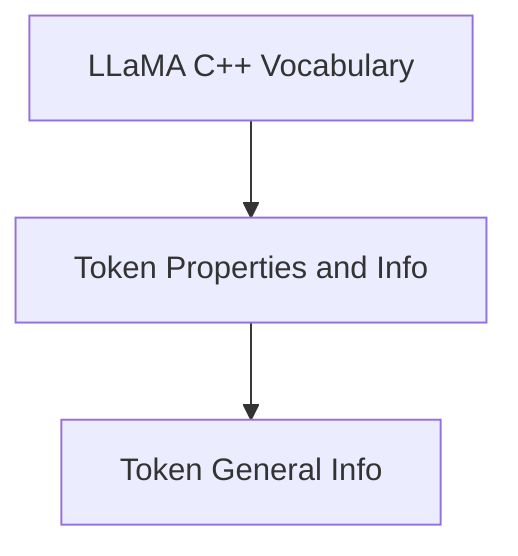

# Token General Information Module

## Introduction

The `token_general_info` module provides essential functions for querying basic information about the vocabulary and individual tokens within the LLaMA C++ inference engine. This module serves as a bridge to underlying vocabulary management functionalities, offering a simplified interface to retrieve key token properties.

## Core Functionality

This module exposes the following core functionalities:

### `llama_n_vocab`
Retrieves the total number of tokens present in the given `llama_vocab` structure. This function is crucial for understanding the size of the vocabulary.

### `llama_token_get_score`
Obtains the score associated with a specific `llama_token` from the provided `llama_vocab`. Token scores are often used in tokenization and sampling processes to evaluate the desirability or frequency of a token.

## Architecture and Component Relationships

The `token_general_info` module is a part of the larger `llama_cpp_vocab` module, specifically nested under `token_properties_and_info`. It directly interacts with the core `llama_vocab` structure to extract token-related metadata. Its functions are wrappers around more fundamental vocabulary operations, providing a convenient access layer.

<!-- DIAGRAM_JSON
{
    "direction": "TD",
    "nodes": [
        {"id": "token_general_info", "label": "Token General Info", "type": "module", "link": "token_general_info.md"},
        {"id": "token_properties_and_info", "label": "Token Properties and Info", "type": "module", "link": "token_properties_and_info.md"},
        {"id": "llama_cpp_vocab", "label": "LLaMA C++ Vocabulary", "type": "module", "link": "llama_cpp_vocab.md"}
    ],
    "edges": [
        {"source": "token_properties_and_info", "target": "token_general_info"},
        {"source": "llama_cpp_vocab", "target": "token_properties_and_info"}
    ],
    "groups": []
}
-->

