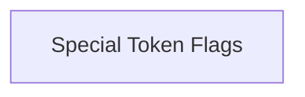

# Token Management Flags

The `token_management_flags` module is responsible for managing flags related to special tokens within the vocabulary, specifically for the Beginning of Sentence (BOS) and End of Sentence (EOS) tokens. It provides functionality to query whether these tokens should be added during tokenization processes.

## Architecture Overview

This module contains a single sub-module, `special_token_flags`, which encapsulates the logic for retrieving the BOS and EOS token flags from the `llama_vocab` structure.

<!-- DIAGRAM_JSON
{
    "direction": "TD",
    "nodes": [
        {"id": "special_token_flags", "label": "Special Token Flags", "type": "module", "link": "special_token_flags.md"}
    ],
    "edges": [],
    "groups": []
}
-->

## Sub-modules

### [Special Token Flags](special_token_flags.md)

Manages flags for adding Beginning of Sentence (BOS) and End of Sentence (EOS) tokens to the vocabulary.