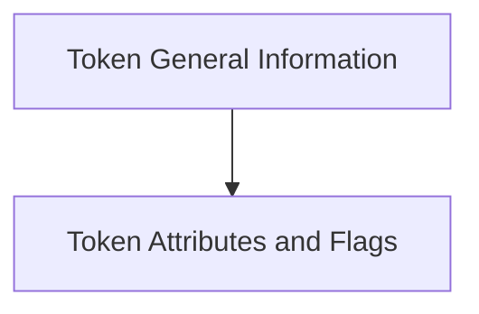

# Token Properties and Info Module

## Introduction
The `token_properties_and_info` module is a crucial component within the `llama_cpp_vocab` module, providing essential functionalities for retrieving detailed information and properties of tokens from a `llama_vocab` structure. This module enables developers to inspect token attributes, scores, and various flags, which are vital for tasks such as tokenization, text processing, and understanding model outputs.

## Architecture Overview
The module is logically divided into two sub-modules, each focusing on a specific aspect of token information retrieval. The architecture ensures a clear separation of concerns, making the codebase maintainable and extensible.

<!-- DIAGRAM_JSON
{
    "direction": "TD",
    "nodes": [
        {"id": "token_general_info", "label": "Token General Information", "type": "module", "link": "token_general_info.md"},
        {"id": "token_attributes_and_flags", "label": "Token Attributes and Flags", "type": "module", "link": "token_attributes_and_flags.md"}
    ],
    "edges": [
        {"source": "token_general_info", "target": "token_attributes_and_flags"}
    ],
    "groups": []
}
-->

## Sub-modules

### [Token General Information](token_general_info.md)
This sub-module provides core functions for retrieving general details about tokens, such as the total number of tokens in the vocabulary (`llama_n_vocab`) and the score associated with a specific token (`llama_token_get_score`).

### [Token Attributes and Flags](token_attributes_and_flags.md)
This sub-module focuses on advanced token properties, including functions to get the attribute of a token (`llama_token_get_attr`), check if a token signifies the end-of-generation (`llama_token_is_eog`), or determine if a token is a control token (`llama_token_is_control`).
