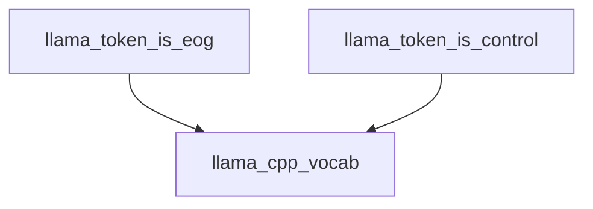

# `token_property_checks` Module Documentation

The `token_property_checks` module is a leaf module within the `llama_cpp_vocab` hierarchy, specifically nested under `token_flag_checks` and `token_attributes_and_flags`. Its primary purpose is to provide utility functions for identifying specific properties of Llama tokens, such as whether a token signifies the end of a generation or if it is a control token. These checks are crucial for token processing, understanding token semantics, and managing the generation flow within the Llama model.

### Architecture and Component Relationships

This module contains two core functions that act as wrappers around lower-level `llama_vocab` functions:

*   **`llama_token_is_eog`**: Determines if a given token represents an "end of generation" marker. This is vital for stopping text generation at appropriate points.
*   **`llama_token_is_control`**: Checks if a token is a "control" token. Control tokens often have special meanings within the model's operation, such as instructing specific behaviors or marking structural elements.

Both functions directly delegate to the underlying `llama_vocab` module for their respective checks, ensuring consistency with the vocabulary's internal definitions. This design keeps the `token_property_checks` module lightweight and focused on providing a clear API for these specific token queries.

### How the Module Fits into the Overall System

The `token_property_checks` module is a fundamental component for token analysis within the `llama_cpp_vocab` system. It enables higher-level modules, such as those responsible for text generation, parsing, or special token handling, to easily query token properties without needing to delve into the intricate details of the `llama_vocab`'s internal structure. By providing clear and concise checks for "end of generation" and "control" tokens, it helps in orchestrating the flow of the language model, ensuring correct termination of sequences and appropriate handling of operational tokens.

<!-- DIAGRAM_JSON
{
    "direction": "TD",
    "nodes": [
        {"id": "llama_token_is_eog", "label": "llama_token_is_eog", "type": "component", "link": null},
        {"id": "llama_token_is_control", "label": "llama_token_is_control", "type": "component", "link": null},
        {"id": "llama_cpp_vocab", "label": "llama_cpp_vocab", "type": "external", "link": "llama_cpp_vocab.md"}
    ],
    "edges": [
        {"source": "llama_token_is_eog", "target": "llama_cpp_vocab"},
        {"source": "llama_token_is_control", "target": "llama_cpp_vocab"}
    ],
    "groups": []
}
-->
