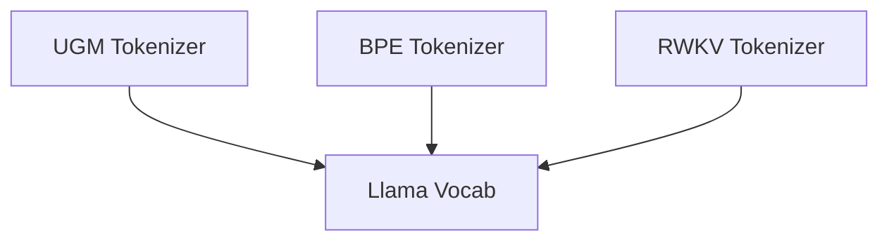

# Tokenizer Algorithms Module Documentation

## Introduction

The `tokenizer_algorithms` module, residing within the `llama_cpp_vocab` module, is responsible for implementing various tokenization algorithms essential for processing text in Large Language Models (LLMs). These algorithms convert raw text into sequences of tokens, which are then used by the LLM for further processing. The module provides implementations for Unigram, Byte Pair Encoding (BPE), and RWKV tokenization.

## Architecture Overview

The `tokenizer_algorithms` module is composed of several sub-modules, each implementing a specific tokenization approach. These sub-modules interact with the core `llama_vocab` structure to access vocabulary data, token scores, and special token information.

<!-- DIAGRAM_JSON
{
    "direction": "TD",
    "nodes": [
        {"id": "ugm_tokenizer", "label": "UGM Tokenizer", "type": "module", "link": "ugm_tokenizer.md"},
        {"id": "bpe_tokenizer", "label": "BPE Tokenizer", "type": "module", "link": "bpe_tokenizer.md"},
        {"id": "rwkv_tokenizer", "label": "RWKV Tokenizer", "type": "module", "link": "rwkv_tokenizer.md"}
    ],
    "edges": [
        {"source": "ugm_tokenizer", "target": "llama_cpp_vocab"},
        {"source": "bpe_tokenizer", "target": "llama_cpp_vocab"},
        {"source": "rwkv_tokenizer", "target": "llama_cpp_vocab"}
    ],
    "groups": []
}
-->

## Sub-modules

### [UGM Tokenizer](ugm_tokenizer.md)

This sub-module implements the Unigram Language Model (UGM) tokenization algorithm. It leverages precompiled character maps and a naive trie data structure for efficient token matching and score management. It handles normal, user-defined, and unused tokens within the vocabulary, assigning scores and managing replacement strings for prefixes.

### [BPE Tokenizer](bpe_tokenizer.md)

The BPE Tokenizer sub-module provides the Byte Pair Encoding algorithm, a widely used tokenization method. It supports various pre-tokenizer types, each with its specific set of regular expressions for splitting text into initial token candidates before BPE merging. This flexibility allows it to adapt to different model architectures and language characteristics.

### [RWKV Tokenizer](rwkv_tokenizer.md)

The RWKV Tokenizer sub-module is designed for models utilizing the RWKV architecture, which can support arbitrary byte tokens. It constructs a naive trie from the vocabulary, decoding unescaped RWKV tokens to enable efficient lookup and processing of byte sequences during tokenization.