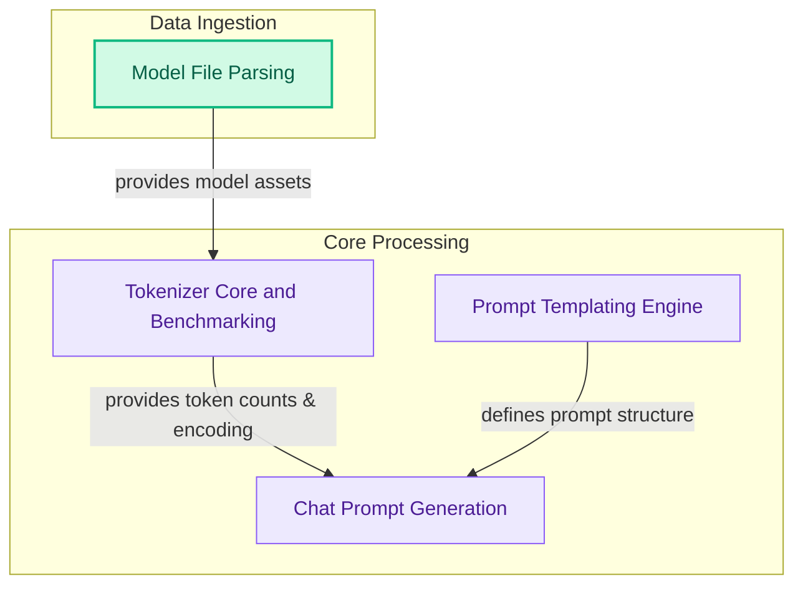

# Tokenizer and Prompting Module
This module is responsible for tokenizing input text, managing prompt templates, and generating structured prompts for models, including handling dynamic content, chat history, and model-specific rendering rules. It also includes components for parsing model files and benchmarking tokenizer performance.

<!-- DIAGRAM_JSON
{
    "direction": "TD",
    "nodes": [
        {"id": "tokenizer_core", "label": "Tokenizer Core and Benchmarking", "type": "module", "link": "tokenizer_core.md"},
        {"id": "prompt_templating", "label": "Prompt Templating Engine", "type": "module", "link": "prompt_templating.md"},
        {"id": "prompt_generation", "label": "Chat Prompt Generation", "type": "module", "link": "prompt_generation.md"},
        {"id": "model_file_parsing", "label": "Model File Parsing", "type": "module", "link": "model_file_parsing.md"}
    ],
    "edges": [
        {"source": "model_file_parsing", "target": "tokenizer_core", "label": "provides model assets"},
        {"source": "tokenizer_core", "target": "prompt_generation", "label": "provides token counts & encoding"},
        {"source": "prompt_templating", "target": "prompt_generation", "label": "defines prompt structure"}
    ],
    "groups": [
        {"id": "data_ingestion", "label": "Data Ingestion", "role": "data", "nodes": ["model_file_parsing"]},
        {"id": "core_processing", "label": "Core Processing", "role": "analytical", "nodes": ["tokenizer_core", "prompt_templating", "prompt_generation"]}
    ]
}
-->

