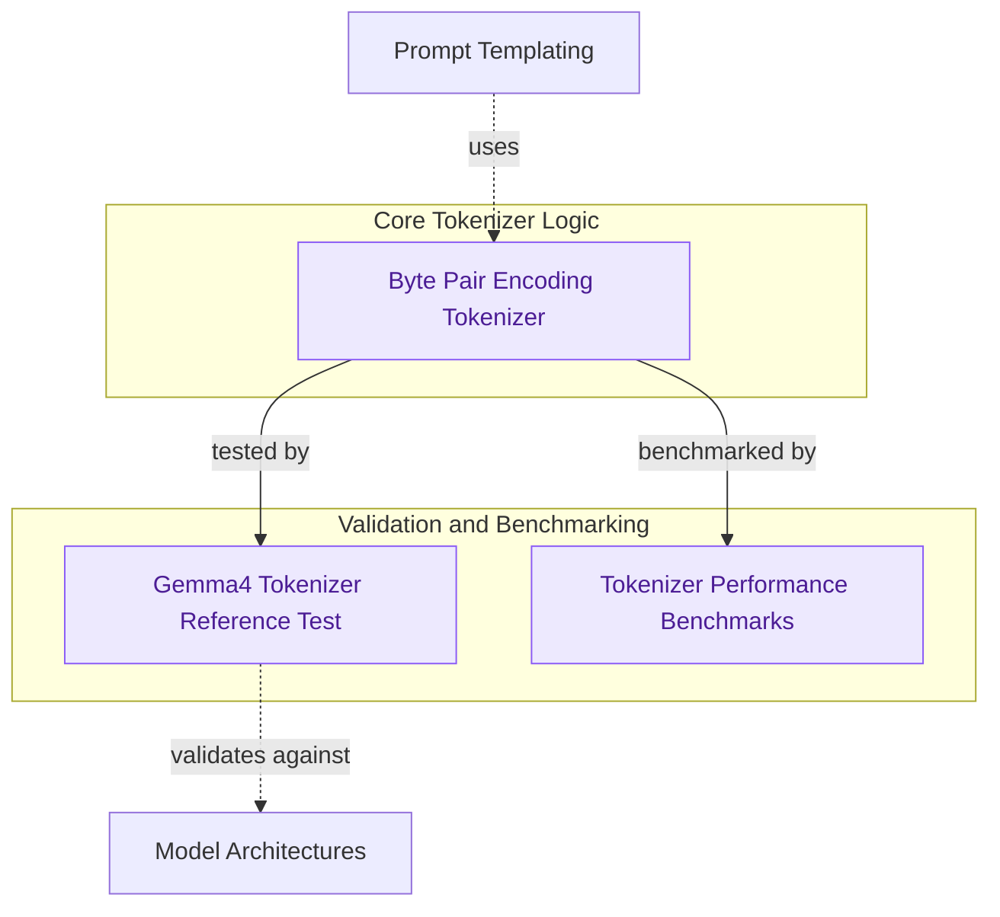

# Tokenizer Core
This module implements the core Byte Pair Encoding (BPE) tokenizer, including performance benchmarks and reference tests to validate its accuracy for models like Gemma4.

<!-- DIAGRAM_JSON
{
    "direction": "TD",
    "nodes": [
        {"id": "bpe_tokenizer", "label": "Byte Pair Encoding Tokenizer", "type": "component", "link": null},
        {"id": "gemma4_reference_test", "label": "Gemma4 Tokenizer Reference Test", "type": "component", "link": null},
        {"id": "tokenizer_benchmarks", "label": "Tokenizer Performance Benchmarks", "type": "component", "link": null},
        {"id": "model_architectures", "label": "Model Architectures", "type": "external", "link": "model_architectures.md"},
        {"id": "prompt_templating", "label": "Prompt Templating", "type": "external", "link": "prompt_templating.md"}
    ],
    "edges": [
        {"source": "bpe_tokenizer", "target": "gemma4_reference_test", "label": "tested by"},
        {"source": "bpe_tokenizer", "target": "tokenizer_benchmarks", "label": "benchmarked by"},
        {"source": "gemma4_reference_test", "target": "model_architectures", "label": "validates against"},
        {"source": "prompt_templating", "target": "bpe_tokenizer", "label": "uses"}
    ],
    "groups": [
        {"id": "tokenizer_core_logic", "label": "Core Tokenizer Logic", "role": "analytical", "nodes": ["bpe_tokenizer"]},
        {"id": "validation_and_benchmarking", "label": "Validation and Benchmarking", "role": "analytical", "nodes": ["gemma4_reference_test", "tokenizer_benchmarks"]}
    ]
}
-->
