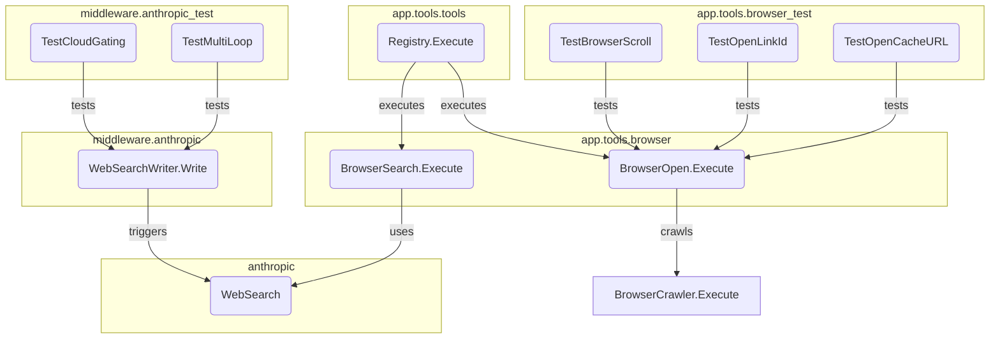

# tool_execution_and_web_search
This module provides core functionalities for executing web searches and browser-like operations, including an Anthropic middleware for integrating web search capabilities into chat responses and a tool registry for managing various tools.

<!-- DIAGRAM_JSON
{
  "nodes": [
    {"id": "anthropic.WebSearch", "label": "WebSearch"},
    {"id": "browser.BrowserSearch.Execute", "label": "BrowserSearch.Execute"},
    {"id": "browser.BrowserOpen.Execute", "label": "BrowserOpen.Execute"},
    {"id": "browser_test.TestScroll", "label": "TestBrowserScroll"},
    {"id": "browser_test.TestOpenLinkId", "label": "TestOpenLinkId"},
    {"id": "browser_test.TestOpenCacheURL", "label": "TestOpenCacheURL"},
    {"id": "tools.Registry.Execute", "label": "Registry.Execute"},
    {"id": "middleware.WebSearchWriter.Write", "label": "WebSearchWriter.Write"},
    {"id": "middleware_test.TestCloudGating", "label": "TestCloudGating"},
    {"id": "middleware_test.TestMultiLoop", "label": "TestMultiLoop"},
    {"id": "BrowserCrawler.Execute", "label": "BrowserCrawler.Execute", "isExternal": true}
  ],
  "edges": [
    {"source": "browser.BrowserSearch.Execute", "target": "anthropic.WebSearch", "label": "uses"},
    {"source": "browser.BrowserOpen.Execute", "target": "BrowserCrawler.Execute", "label": "crawls"},
    {"source": "tools.Registry.Execute", "target": "browser.BrowserSearch.Execute", "label": "executes"},
    {"source": "tools.Registry.Execute", "target": "browser.BrowserOpen.Execute", "label": "executes"},
    {"source": "middleware.WebSearchWriter.Write", "target": "anthropic.WebSearch", "label": "triggers"},
    {"source": "browser_test.TestScroll", "target": "browser.BrowserOpen.Execute", "label": "tests"},
    {"source": "browser_test.TestOpenLinkId", "target": "browser.BrowserOpen.Execute", "label": "tests"},
    {"source": "browser_test.TestOpenCacheURL", "target": "browser.BrowserOpen.Execute", "label": "tests"},
    {"source": "middleware_test.TestCloudGating", "target": "middleware.WebSearchWriter.Write", "label": "tests"},
    {"source": "middleware_test.TestMultiLoop", "target": "middleware.WebSearchWriter.Write", "label": "tests"}
  ],
  "groups": [
    {"id": "anthropic_pkg", "label": "anthropic", "nodes": ["anthropic.WebSearch"]},
    {"id": "app_tools_browser_pkg", "label": "app.tools.browser", "nodes": ["browser.BrowserSearch.Execute", "browser.BrowserOpen.Execute"]},
    {"id": "app_tools_browser_test_pkg", "label": "app.tools.browser_test", "nodes": ["browser_test.TestScroll", "browser_test.TestOpenLinkId", "browser_test.TestOpenCacheURL"]},
    {"id": "app_tools_tools_pkg", "label": "app.tools.tools", "nodes": ["tools.Registry.Execute"]},
    {"id": "middleware_anthropic_pkg", "label": "middleware.anthropic", "nodes": ["middleware.WebSearchWriter.Write"]},
    {"id": "middleware_anthropic_test_pkg", "label": "middleware.anthropic_test", "nodes": ["middleware_test.TestCloudGating", "middleware_test.TestMultiLoop"]}
  ]
}
-->
