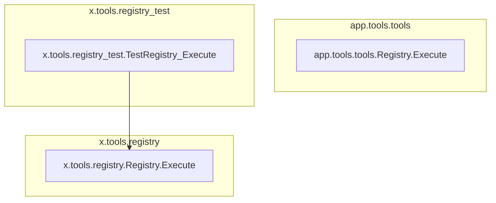

# tool_registry_and_execution
This module defines the core logic for registering and executing various tools through a centralized registry, including different execution interfaces and testing.

<!-- DIAGRAM_JSON
{
  "nodes": [
    {"id": "A", "label": "app.tools.tools.Registry.Execute", "type": "function"},
    {"id": "B", "label": "x.tools.registry.Registry.Execute", "type": "function"},
    {"id": "C", "label": "x.tools.registry_test.TestRegistry_Execute", "type": "test"}
  ],
  "edges": [
    {"from": "C", "to": "B"}
  ],
  "groups": [
    {"id": "app_tools_tools", "label": "app.tools.tools", "nodes": ["A"]},
    {"id": "x_tools_registry", "label": "x.tools.registry", "nodes": ["B"]},
    {"id": "x_tools_registry_test", "label": "x.tools.registry_test", "nodes": ["C"]}
  ]
}
-->
