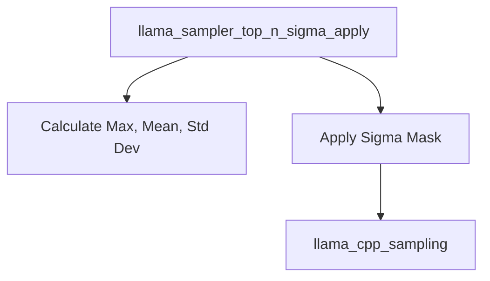

# top_n_sigma_sampling

## Introduction
The `top_n_sigma_sampling` module implements a sampling technique used in large language models to refine the selection of the next token. This method filters out tokens whose logits fall below a certain threshold determined by the maximum logit, the standard deviation of logits, and a configurable `n` value. This helps in controlling the diversity and quality of generated text by focusing on statistically significant tokens.

## Architecture and Core Functionality

### Purpose
The primary purpose of `top_n_sigma_sampling` is to apply a probabilistic filtering mechanism to token logits before final sampling. It works by identifying tokens with logits that are "too far" from the maximum logit, based on a multiple (`n`) of the standard deviation of all logits. Tokens that do not meet this criterion are effectively removed from consideration by setting their logits to negative infinity. This technique helps in generating more coherent and contextually relevant text by reducing the likelihood of selecting outlier tokens.

### Component Relationships
The core functionality of this module is encapsulated within the `llama_sampler_top_n_sigma_apply` function. This function interacts with a `llama_sampler` context, which provides the configuration parameter `n`, and a `llama_token_data_array` containing the logits for candidate tokens. After applying its filtering logic, it delegates the final probability distribution calculation to an external softmax implementation.

<!-- DIAGRAM_JSON
{
    "direction": "TD",
    "nodes": [
        {"id": "top_n_sigma_apply", "label": "llama_sampler_top_n_sigma_apply", "type": "component", "link": null},
        {"id": "calculate_stats", "label": "Calculate Max, Mean, Std Dev", "type": "component", "link": null},
        {"id": "apply_mask", "label": "Apply Sigma Mask", "type": "component", "link": null},
        {"id": "llama_cpp_sampling", "label": "llama_cpp_sampling", "type": "external", "link": "llama_cpp_sampling.md"}
    ],
    "edges": [
        {"source": "top_n_sigma_apply", "target": "calculate_stats"},
        {"source": "top_n_sigma_apply", "target": "apply_mask"},
        {"source": "apply_mask", "target": "llama_cpp_sampling"}
    ],
    "groups": []
}
-->

### Core Components

#### `llama.llama.cpp.src.llama-sampling.llama_sampler_top_n_sigma_apply`
This is the central function of the `top_n_sigma_sampling` module. It performs the following steps:
1.  **Parameter Check**: It first validates the `n` parameter from the `llama_sampler_top_n_sigma` context and the number of available tokens. If `n` is non-positive or only one token is available, no sampling is applied.
2.  **Statistic Calculation**: It iterates through the `llama_token_data_array` to determine the maximum logit, the mean of all valid logits (excluding `-INFINITY`), and the standard deviation of these logits.
3.  **Mask Application**: For each token, it checks if its logit is less than `max_logit - (n * standard_deviation)`. If this condition is met, the token's logit is set to `-INFINITY`, effectively removing it from further consideration in the sampling process.
4.  **Softmax Application**: After applying the sigma-based filtering, it calls `llama_sampler_softmax_impl` (likely part of the [llama_cpp_sampling](llama_cpp_sampling.md) module) to compute the final probability distribution over the remaining valid tokens.

## Integration with the Overall System
The `top_n_sigma_sampling` module is a part of the `llama_cpp_sampling` module, specifically under `core_sampling_techniques` and `adaptive_sampling`. It serves as one of several adaptive sampling strategies that can be employed during the token generation phase of a language model. It integrates into the broader sampling pipeline by accepting a raw array of token logits and returning a modified array suitable for subsequent probability calculations and token selection. This module's output directly influences the diversity and quality of the generated text, making it a critical component for fine-grained control over the model's output. It depends on `llama_cpp_sampling` for the final softmax calculation, which is a common step across various sampling techniques.
