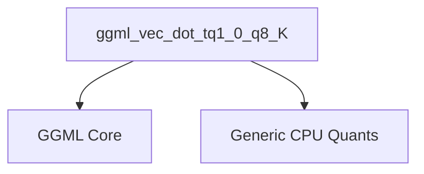

# tq1_dot_products Module Documentation

## Introduction

The `tq1_dot_products` module is a specialized component within the GGML (GGML is a C library for machine learning) framework, specifically designed for highly optimized quantized vector dot product operations on ARM-based CPUs. This module provides an efficient implementation for `tq1_0` and `q8_K` quantization schemes, leveraging ARM NEON intrinsics for enhanced performance. It plays a crucial role in accelerating inference for machine learning models that utilize these specific quantization types.

## Architecture and Core Components

This module contains a single core function, `ggml_vec_dot_tq1_0_q8_K`, which is responsible for computing the dot product of two quantized vectors. The implementation is heavily optimized for ARM processors, including support for the ARM Dot Product instruction set (`__ARM_FEATURE_DOTPROD`).

### Core Functionality: `ggml_vec_dot_tq1_0_q8_K`

- **Purpose**: Computes the dot product of a vector `x` quantized with `block_tq1_0` and a vector `y` quantized with `block_q8_K`.
- **Optimization**: Utilizes ARM NEON intrinsics for parallel processing of vector elements, significantly speeding up the computation.
- **Quantization Handling**: Performs the necessary scaling and bit manipulations specific to `tq1_0` and `q8_K` quantization formats.
- **Fallback Mechanism**: Includes a fallback to a generic implementation (`ggml_vec_dot_tq1_0_q8_K_generic`) if ARM NEON extensions are not available or not enabled.
- **Input/Output**: Takes two quantized input vectors (`vx`, `vy`), their respective block sizes (`bx`, `by`), and an output scalar pointer `s` to store the computed dot product.

### Module Dependencies

The `tq1_dot_products` module relies on several external components for its operation:

- **GGML Core (`ggml_core`)**: Provides fundamental data structures like `block_tq1_0` and `block_q8_K`, as well as utility macros such as `GGML_CPU_FP16_TO_FP32` which are essential for handling quantized data and performing conversions.
- **Generic Quantization Functions (`ggml_cpu_quants_generic`)**: Supplies the generic fallback implementation, `ggml_vec_dot_tq1_0_q8_K_generic`, used when architecture-specific optimizations are not applicable.

## System Integration

The `tq1_dot_products` module is a low-level, highly specialized component integrated into the `ggml_cpu_arm_quants` module, which in turn is part of the broader `ggml_cpu_arm_quants` and `ggml_core` ecosystem. Its primary role is to provide a fast and efficient dot product operation for specific quantized data types (`tq1_0` and `q8_K`) on ARM processors.

This module directly contributes to the performance of quantized machine learning models by offloading computationally intensive dot product calculations to optimized ARM NEON hardware. By being part of the `tiny_k_vec_dots` and `arm_vec_dot_k_quants` hierarchy, it fits into a comprehensive system designed to handle various quantization schemes and CPU architectures efficiently.

<!-- DIAGRAM_JSON
{
    "direction": "TD",
    "nodes": [
        {"id": "ggml_vec_dot_tq1_0_q8_K", "label": "ggml_vec_dot_tq1_0_q8_K", "type": "component", "link": null},
        {"id": "ggml_core", "label": "GGML Core", "type": "external", "link": "ggml_core.md"},
        {"id": "ggml_cpu_quants_generic", "label": "Generic CPU Quants", "type": "external", "link": "ggml_cpu_quants_generic.md"}
    ],
    "edges": [
        {"source": "ggml_vec_dot_tq1_0_q8_K", "target": "ggml_core"},
        {"source": "ggml_vec_dot_tq1_0_q8_K", "target": "ggml_cpu_quants_generic"}
    ],
    "groups": []
}
-->

