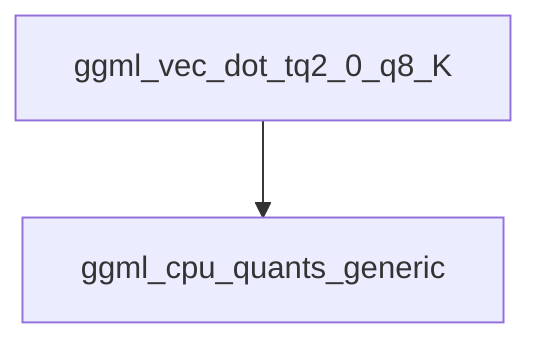

# `tq2_k_vec_dots` Module Documentation

The `tq2_k_vec_dots` module provides highly optimized vector dot product implementations specifically for `tq2_0` and `q8_K` quantized data types within the GGML CPU backend for x86 architectures. It leverages AVX2 intrinsics for significant performance gains in quantized model inference.

### Purpose and Core Functionality

The primary purpose of the `tq2_k_vec_dots` module is to offer an efficient routine for computing the dot product between two quantized vectors: one represented in `tq2_0` format and the other in `q8_K` format. This operation is fundamental in various machine learning models, especially large language models, where quantization is employed to reduce memory footprint and improve inference speed.

The core functionality is encapsulated in the `ggml_vec_dot_tq2_0_q8_K` function, which performs the following:
*   **Vector Dot Product**: Calculates the dot product of `block_tq2_0` and `block_q8_K` quantized blocks.
*   **AVX2 Optimization**: Utilizes AVX2 SIMD instructions to process multiple data elements in parallel, leading to faster computations on compatible x86 CPUs.
*   **Quantization Handling**: Correctly unpacks and multiplies the quantized values, incorporating scaling factors (`d`) and block sums (`bsums`) specific to the `tq2_0` and `q8_K` quantization schemes to produce an accurate floating-point result.
*   **Fallback Mechanism**: Includes a fallback to a generic implementation (`ggml_vec_dot_tq2_0_q8_K_generic`) if AVX2 is not available, ensuring compatibility across different CPU capabilities.

### Architecture and Component Relationships

The `tq2_k_vec_dots` module is a leaf module within a deep hierarchy of quantization-specific CPU implementations for GGML. It resides under `ggml_cpu_x86_quants`, specifically in the `tiny_k_vec_dots` sub-group, indicating its role in handling "tiny" K-quantization vector dot products on x86 architectures.

The main component is `ggml_vec_dot_tq2_0_q8_K`. This function directly interacts with:
*   **Input Data Structures**: `block_tq2_0` and `block_q8_K`, which define the layout and properties of the quantized data blocks. These structures are internal to the GGML quantization framework and are passed as `void *` pointers to the function.
*   **AVX2 Intrinsics**: A set of low-level CPU instructions (`_mm256_...`) for vectorized operations, directly programmed into the C code for maximum performance.
*   **Helper Functions**: It uses `hsum_float_8` for horizontally summing the final AVX2 `__m256` vector to produce a single float result. This is typically an inline utility function within the GGML CPU backend.
*   **Generic Fallback**: In the absence of AVX2 support, it delegates the computation to `ggml_vec_dot_tq2_0_q8_K_generic`, which is part of the `ggml_cpu_quants_generic` module.

### Module Integration

The `tq2_k_vec_dots` module is an integral part of the `ggml_cpu_x86_quants` system, providing a highly optimized primitive for quantized linear algebra operations. It is invoked by higher-level GGML operations when a dot product between `tq2_0` and `q8_K` tensors is required on an x86 CPU with AVX2 support.

Its optimized implementation contributes directly to the overall efficiency of running quantized machine learning models with the GGML library, particularly for models employing the `tq2_0` and `q8_K` quantization schemes. By providing a fast, specialized routine for this specific quantization pair, it helps in achieving real-time or near real-time inference performance on commodity hardware.

<!-- DIAGRAM_JSON
{
    "direction": "TD",
    "nodes": [
        {"id": "ggml_vec_dot_tq2_0_q8_K", "label": "ggml_vec_dot_tq2_0_q8_K", "type": "component", "link": null},
        {"id": "ggml_cpu_quants_generic", "label": "ggml_cpu_quants_generic", "type": "external", "link": "ggml_cpu_quants_generic.md"}
    ],
    "edges": [
        {"source": "ggml_vec_dot_tq2_0_q8_K", "target": "ggml_cpu_quants_generic"}
    ],
    "groups": []
}
-->
