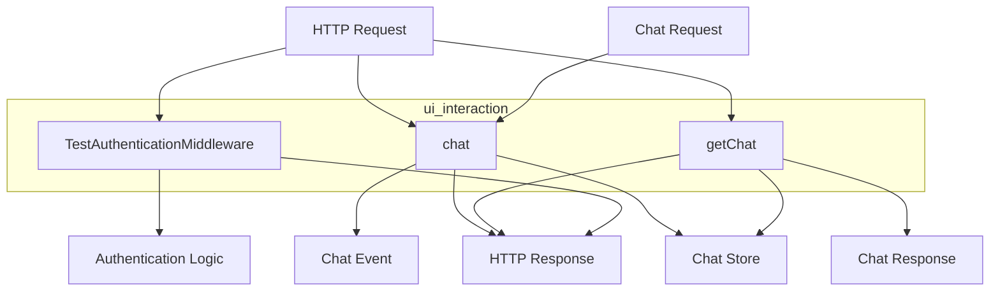

# ui_interaction
This module handles user interface interactions, specifically managing chat sessions through HTTP requests and responses, and includes tests for authentication middleware.

<!-- DIAGRAM_JSON
{
  "nodes": [
    {"id": "ui_interaction", "label": "ui_interaction", "type": "module"},
    {"id": "ChatHandler", "label": "chat", "type": "component"},
    {"id": "GetChatHandler", "label": "getChat", "type": "component"},
    {"id": "AuthMiddlewareTest", "label": "TestAuthenticationMiddleware", "type": "component"},
    {"id": "HTTPRequest", "label": "HTTP Request", "type": "external"},
    {"id": "HTTPResponse", "label": "HTTP Response", "type": "external"},
    {"id": "ChatStore", "label": "Chat Store", "type": "internal_dependency"},
    {"id": "ChatRequest", "label": "Chat Request", "type": "data_structure"},
    {"id": "ChatResponse", "label": "Chat Response", "type": "data_structure"},
    {"id": "ChatEvent", "label": "Chat Event", "type": "data_structure"},
    {"id": "AuthLogic", "label": "Authentication Logic", "type": "internal_concept"}
  ],
  "edges": [
    {"source": "HTTPRequest", "target": "ChatHandler", "label": "Input"},
    {"source": "ChatHandler", "target": "HTTPResponse", "label": "Output"},
    {"source": "ChatRequest", "target": "ChatHandler", "label": "Uses"},
    {"source": "ChatHandler", "target": "ChatStore", "label": "Modifies/Reads"},
    {"source": "ChatHandler", "target": "ChatEvent", "label": "Generates"},
    {"source": "HTTPRequest", "target": "GetChatHandler", "label": "Input"},
    {"source": "GetChatHandler", "target": "HTTPResponse", "label": "Output"},
    {"source": "GetChatHandler", "target": "ChatStore", "label": "Reads"},
    {"source": "GetChatHandler", "target": "ChatResponse", "label": "Generates"},
    {"source": "HTTPRequest", "target": "AuthMiddlewareTest", "label": "Input"},
    {"source": "AuthMiddlewareTest", "target": "HTTPResponse", "label": "Output"},
    {"source": "AuthMiddlewareTest", "target": "AuthLogic", "label": "Tests"}
  ],
  "groups": [
    {"id": "ui_interaction_group", "label": "ui_interaction", "nodes": ["ChatHandler", "GetChatHandler", "AuthMiddlewareTest"]}
  ]
}
-->
