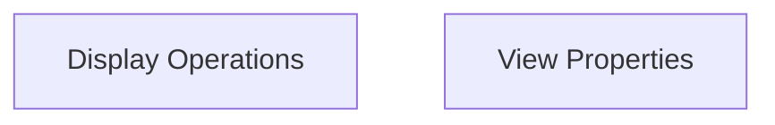

# UI Operations Module Documentation

## Introduction and Purpose

The `ui_operations` module is responsible for managing the user interface aspects of the webview component. It provides functionalities to control the visual presentation and dynamic properties of the webview, such as setting the title, HTML content, window size, and zoom level.

## Architecture Overview

The `ui_operations` module is structured into two main sub-modules:

*   `display_operations`: Handles actions that directly affect how the webview is displayed.
*   `view_properties`: Manages the retrieval and modification of various webview properties.

These sub-modules interact with the underlying webview implementation to provide a consistent interface for UI control.

<!-- DIAGRAM_JSON
{
    "direction": "TD",
    "nodes": [
        {"id": "display_operations", "label": "Display Operations", "type": "module", "link": "display_operations.md"},
        {"id": "view_properties", "label": "View Properties", "type": "module", "link": "view_properties.md"}
    ],
    "edges": [],
    "groups": []
}
-->

## Sub-modules

### [Display Operations](display_operations.md)
This sub-module focuses on operations that directly control the visual output of the webview. It includes functions for setting the window title, rendering HTML content, and adjusting the dimensions of the webview window.

### [View Properties](view_properties.md)
This sub-module provides capabilities to query and manipulate the dynamic properties of the webview. It offers functions to retrieve the current size of the webview and to control its zoom level, ensuring a flexible and responsive user experience.